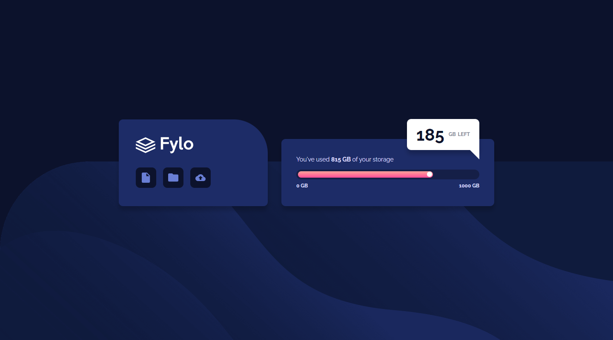

# Frontend Mentor - Fylo data storage component solution

This is a solution to the [Fylo data storage component challenge on Frontend Mentor](https://www.frontendmentor.io/challenges/fylo-data-storage-component-1dZPRbV5n).

## Table of contents

- [Overview](#overview)
  - [The challenge](#the-challenge)
  - [Screenshot](#screenshot)
  - [Links](#links)
- [My process](#my-process)
  - [Built with](#built-with)
  - [What I learned](#what-i-learned)
  - [Continued development](#continued-development)
  - [Useful resources](#useful-resources)
- [Author](#author)
- [Acknowledgments](#acknowledgments)

## Overview

### The challenge

Users should be able to:

- View the optimal layout for the site depending on their device's screen size

### Screenshot

Desktop


Mobile


### Links

- [Live Site](https://gc23-fylo-data-storage.netlify.app)

## My process

### Built with

- Semantic HTML5 markup
- CSS custom properties
- Flexbox
- Mobile-first workflow

### What I learned

The main thing I learned in this challenge is how to make progress bars.

In the html, they're simply `<div>`s stacked on top of each other:

```
<div class="card__bar">
  <div class="bar__progress"></div>
</div>
```

I used an absolutely-positioned pseudoelement to make the progress bar's icon (the white circle).

Also, on making the card's widths responsive on the mobile layout, I couldn't figure out why `align-items` was making my card shrink despite it having a `max-width`. I solved the issue by adding an explicit `width` of `100`

### Continued development

- I'd like to do more loading/progress bars. Especially functional ones.

### Useful resources

- [This list of progress bars](https://alvarotrigo.com/blog/progress-bar-css/) helped me learn how to make the one in this project.
- [This question on stack](https://stackoverflow.com/questions/35836415/flexbox-align-items-center-shrinks-a-childs-max-width) helped me figure out what's causing my width issue on mobile.

## Author

- Frontend Mentor - [@GioCura](https://www.frontendmentor.io/profile/GioCura)
