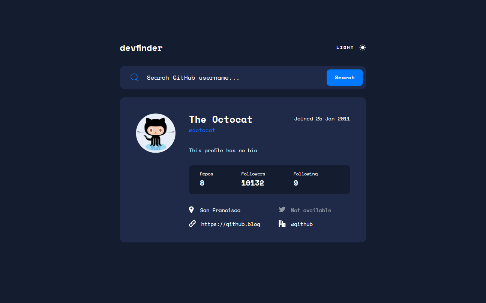
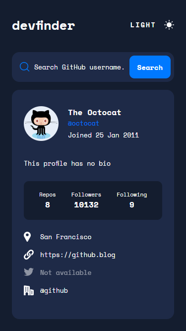

# Frontend Mentor - GitHub user search app solution

This is a solution to the [GitHub user search app challenge on Frontend Mentor](https://www.frontendmentor.io/challenges/github-user-search-app-Q09YOgaH6).

## Table of contents

- [Overview](#overview)
  - [The challenge](#the-challenge)
  - [Screenshot](#screenshot)
  - [Links](#links)
- [My process](#my-process)
  - [Built with](#built-with)
  - [What I learned](#what-i-learned)
  - [Continued development](#continued-development)
  - [Useful resources](#useful-resources)
- [Author](#author)
- [Acknowledgments](#acknowledgments)

## Overview

### The challenge

Users should be able to:

- View the optimal layout for the app depending on their device's screen size
- See hover states for all interactive elements on the page
- Search for GitHub users by their username
- See relevant user information based on their search
- Switch between light and dark themes
- **Bonus**: Have the correct color scheme chosen for them based on their computer preferences. _Hint_: Research `prefers-color-scheme` in CSS.

### Screenshot




### Links

- [Live site](https://gc37-devfinder.netlify.app/)

## My process

### Built with

- Semantic HTML5 markup
- CSS custom properties
- CSS Grid
- Vanilla JS
- Mobile-first workflow
- MVC model

### What I learned

- I learned how to make an alternate color scheme by having a class (`dark-mode` in this case) that overrides the existing `:root` declarations. The theme is triggered by adding said class to the document's body.

- I learned how to handle a site's dynamic content (the GitHub user that was searched, in this case) by programmatically changing the index's markup via JS.

  - Furthermore, in handling different conditions that affect the element's presentation (ex. unavailable data, date format), I found it helpful to insert helper functions in the template literal. I used a lot of ternary operators, and functions that returned them.

- In handling the toggle between themes, I start by having a default state variable:

```
defaultTheme = false;
```

- When the toggle is clicked, this value is flipped:

```
ThemeView.defaultTheme = !ThemeView.defaultTheme;
```

- And is then used as a parameter for the toggle function:

```
  ThemeView.toggleDarkMode(ThemeView.defaultTheme);
```

```
toggleDarkMode(state) {
  this.defaultTheme = state;
  const themeNotification = `theme set to ${
    state === true ? `dark` : `light`
  } mode`;
  document.documentElement.classList.toggle("dark-mode", state);
  this._parentElement.innerHTML = state === true ? markupDark : markupLight;
  this._parentElement.setAttribute("aria-label", themeNotification);
}
```

- The setting is saved in local storage:

```
export const setDarkModeLocalStorage = function (status) {
  localStorage.setItem("dark-mode", status);
  state.darkMode = status;
};
```

- When loading the site, that setting is retrieved:

```
const init = function () {
  const storage = localStorage.getItem("dark-mode");
  if (storage) state.darkMode = storage;
};

init();
```

- And then the toggle function is called, checking whether a setting was previously set and is true, or if the user prefers a dark color scheme by default:

```
prefersDark = window.matchMedia("(prefers-color-scheme: dark)");
```

```
ThemeView.toggleDarkMode(
  model.state.darkMode
    ? model.state.darkMode == "true"
    : ThemeView.prefersDark.matches
);
```

- To prevent users from seeing the switch between color schemes happen on load, a script of the top of the html's `<head>` is called:

```
<head>
  <script>
    if (
      localStorage.getItem("dark-mode") === `true` ||
      window.matchMedia("(prefers-color-scheme: dark)").matches
    )
      document.documentElement.classList.add("dark-mode");

    if (
      localStorage.getItem("dark-mode") === `false` ||
      window.matchMedia("(prefers-color-scheme: light)").matches
    )
      document.documentElement.classList.remove("dark-mode");
  </script>
```

- And to prevent the users from seeing the transition animation, a script that declares the transition style is written at the end of the `<body>`:

```
<script>
  window.addEventListener("load", function () {
    document.body.style.transition = "color 0.5s, background-color 0.5s";
  });
</script>
```

### Continued development

- I'd like to handle projects that incorporate local storage more.

### Useful resources

- [This tutorial](https://www.ditdot.hr/en/dark-mode-website-tutorial) served as the basis for my theme scripting.
- [@Chemah's script in this SO thread](https://stackoverflow.com/questions/43803778/href-without-https-prefix) is adapted in my script to produce clickable links to users who didn't write "http://" or "https://" for their website.

## Author

- [@GioCura](https://www.frontendmentor.io/profile/GioCura)

## Acknowledgments

I frequently was looking at the functionality of [@ecemgo](https://ecemgo-github-user-search-app.netlify.app/), [@vanziasetia](https://officialdevfinder.netlify.app/), and [Roan Alpha](https://github-user-search-app-roan-alpha.vercel.app/)'s solutions as I made my own. I'd like to thank them all!
