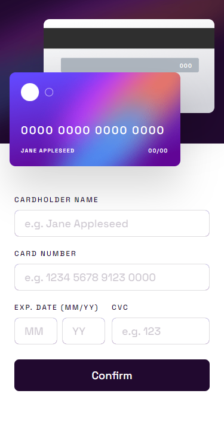

# Frontend Mentor - Interactive card details form solution

This is a solution to the [Interactive card details form challenge on Frontend Mentor](https://www.frontendmentor.io/challenges/interactive-card-details-form-XpS8cKZDWw).

## Table of contents

- [Overview](#overview)
  - [The challenge](#the-challenge)
  - [Screenshot](#screenshot)
  - [Links](#links)
- [My process](#my-process)
  - [Built with](#built-with)
  - [What I learned](#what-i-learned)
  - [Continued development](#continued-development)
  - [Useful resources](#useful-resources)
- [Author](#author)
- [Acknowledgments](#acknowledgments)

## Overview

### The challenge

Users should be able to:

- Fill in the form and see the card details update in real-time
- Receive error messages when the form is submitted if:
  - Any input field is empty
  - The card number, expiry date, or CVC fields are in the wrong format
- View the optimal layout depending on their device's screen size
- See hover, active, and focus states for interactive elements on the page

### Screenshot

Desktop

Desktop - Active

Desktop - Complete

Mobile


### Links

- [Live site](https://gc27-interactive-card-details-form.netlify.app/)

## My process

### Built with

- Semantic HTML5 markup
- CSS custom properties
- Flexbox
- Vainlla JS
- Mobile-first workflow

### What I learned

- I took this challenge on so I can practice more complex form validation.

- This is the first time that I've used the `pattern` `input` attribute extensively. In doing so, I had to learn the basics of Regular Expressions, which can be used both in HTML and JS. I admit that I don't get it enough to be self-sufficient, but I found some very helpful resources in the process of making this project. Indeed, I depended so much on researched info for this one.

- For styling the form, I learned to use the `fieldset` attribute to nest two inputs together. This was necessary for the MM/YY input. I also learned to override its default width setting by setting `min-width` to `0`.

- In making a border with a linear-gradient, I learned to use the `background` attribute's `padding-box` and `border-box` properties:

```
.details__form input {
  border: 1px solid transparent;
  background: linear-gradient(white, white) padding-box,
    var(--inputborder) border-box;
}
```

- Beyond that, the layout itself was straightforward. This time though, I finally used figma files for the first time. I can't overstate how easier this made my life.

- A lot of the script here was based off of my previous projects. However, in optimizing the script, I learned to use `indexOf()`, `test()`, and `location.reload()`.

I used `indexOf()` as a means to get the correct node index of each input's error message:

```
let e = numberElArray.indexOf(el, 0) - 1;
if (e === -1 || e === 0) {
e++;
}

if (el.validity.valueMissing) {
errorNumberEl[e].textContent = "Can't be blank";
}
```

I used `test()` to match the input value to a regular expression:

```
let correctFormat = regExNumber.test(el.value);

    if (el.validity.tooShort && correctFormat) {
    errorNumberEl[e].textContent = "Incomplete";

}
```

Then, I used `location.reload()` to reload the page upon the user's clicking of the continue button:

```
continueEl.addEventListener("click", function () {
location.reload();
});
```

Aside from new functions, I also wrote more complex script.

Since the MM/YY input must only remove error messages when both are valid. I wrote this:

```
    if (el.validity.valid) {
      el.classList.remove("invalid");
      if (el === yyEl || el === mmEl) {
        mmyyInputs.classList.remove("invalid");
        if (mmEl.validity.valid || yyEl.validity.valid) {
          if (!mmEl.validity.valid || !yyEl.validity.valid) {
            errorNumberEl[e].style.height =
              errorNumberEl[e].scrollHeight + "px";
          } else {
            errorNumberEl[e].style.height = "0";
          }
        }
      } else {
        errorNumberEl[e].style.height = "0";
      }
    } else {
      numberElError(el);
    }
```

I also wrote an animation script that resets the style once it's finished, so that it is repeatable:

```
function errorAnim(el) {
el.style.animation = ".5s shake";

el.addEventListener("animationend", function () {
el.style.animation = "none";
});
}
```

Another thing I learned is that Firefox has an autocomplete function that saves people's inputs. This is not ideal for the toggles and inputs that I've made so far, so I found a workaround.

First, I set `autocomplete` to `off` in the html code of the input.

Then, I use Javascript to set that to "on":

```
inputEl.forEach(function (e) {
  e.autocomplete = "on";
});
```

So, as the page loads, the autocomplete is turned off, but is immediately turned on again once the browser loads the script.

### Continued development

- More forms, with more demanding validation criteria.
- More practice making and using regular expressions.
- More practice using figma files.

### Useful resources

- [This SO thread](https://stackoverflow.com/questions/9004307/two-input-fields-inside-one-label) taught me to use `fieldset` for nesting two inputs together, as was required for the MM/YY inputs.
- [This SO thread](https://stackoverflow.com/questions/34173608/regex-for-a-valid-month) showed me a proper way to make a regex for a valid month number.
- [This SO thread](https://stackoverflow.com/questions/7459704/in-javascript-what-is-the-best-way-to-convert-a-nodelist-to-an-array) showed me how to convert a NodeList to an array, which I used in scripting the error messages.
- [This SO thread](https://stackoverflow.com/questions/70362665/regex-add-space-in-string-if-the-word-is-longer-than-4-characters-and-have-numbe) taught me a very minimalist way of adding a space after 4 characters in the card number input field.
- [This SO thread](https://stackoverflow.com/questions/27660423/fieldset-width-100-of-parent) taught me how to override the `fieldset`'s default width by using `min-width: 0;`
- [This blog post](https://codyhouse.co/nuggets/css-gradient-borders) taught me how to make a gradient border.
- [This W3Schools page](https://www.w3schools.com/jsref/met_loc_reload.asp) taught me how to trigger a reload event.
- [This SO thread](https://stackoverflow.com/questions/2486474/preventing-firefox-from-remembering-the-input-value-on-refresh-with-a-meta-tag) taught me how to override the `autocomplete` on Firefox.

## Author

- Frontend Mentor - [@GioCura](https://www.frontendmentor.io/profile/GioCura)

## Acknowledgments

Thank you to all the people who contributed to the threads and articles I mentioned above.

Thank you to Zellene for helping me debug the project on iOS devices.
