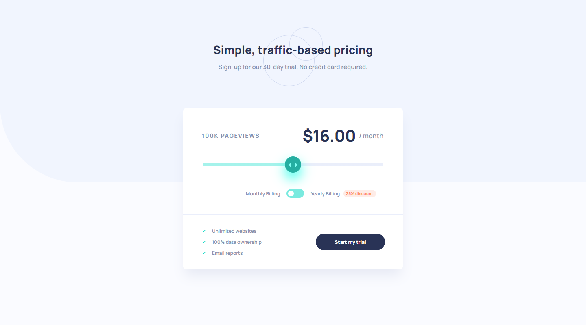

# Frontend Mentor - Interactive pricing component solution

This is a solution to the [Interactive pricing component challenge on Frontend Mentor](https://www.frontendmentor.io/challenges/interactive-pricing-component-t0m8PIyY8).

## Table of contents

- [Overview](#overview)
  - [The challenge](#the-challenge)
  - [Screenshot](#screenshot)
  - [Links](#links)
- [My process](#my-process)
  - [Built with](#built-with)
  - [What I learned](#what-i-learned)
  - [Continued development](#continued-development)
  - [Useful resources](#useful-resources)
- [Author](#author)
- [Acknowledgments](#acknowledgments)

## Overview

### The challenge

Users should be able to:

- View the optimal layout for the app depending on their device's screen size
- See hover states for all interactive elements on the page
- Use the slider and toggle to see prices for different page view numbers

### Screenshot

Desktop

Desktop - Active

Mobile


### Links

- [Live site](https://gc28-interactive-pricing-component.netlify.app/)

## My process

### Built with

- Semantic HTML5 markup
- CSS custom properties
- Flexbox
- CSS Grid
- Vanilla JS
- Mobile-first workflow

### What I learned

- I learned how to make sliders, and also about how complicated it is to make them look the same across browsers. I learned that it involves making style declarations for both `::-webkit` and `-::moz`. The specific elements to take care of were:

```
::-webkit-slider-thumb
::-moz-range-thumb
:focus-visible
:focus-visible::-webkit-slider-thumb
:focus-visible::-moz-range-thumb
:hover::-webkit-slider-thumb
:hover::-moz-range-thumb
:active::-webkit-slider-thumb
:active::-moz-range-thumb
```

- Along the way, I learned about the `grabbing` setting of the `cursor` attribute.

- I learned to style the slider's progress bar using JS:

```
  let progressValue =
    ((event.target.value - event.target.min) /
      (event.target.max - event.target.min)) *
    100;

  event.target.style.background =
    "linear-gradient(to right, var(--slider) 0%, var(--slider) " +
    progressValue +
    "%, var(--emptyslider) " +
    progressValue +
    "%, var(--emptyslider) 100%)";
```

### Continued development

I'd like to do more projects involving sliders.

### Useful resources

- [This guide](https://www.smashingmagazine.com/2021/12/create-custom-range-input-consistent-browsers/) was invaluable in helping make the slider look the same across all browsers.
- [dargue3's answer in this SO thread](https://stackoverflow.com/questions/18389224/how-to-style-html5-range-input-to-have-different-color-before-and-after-slider) taught me a simple way to style the progressed section of the slider.

## Author

- Frontend Mentor - [@GioCura](https://www.frontendmentor.io/profile/GioCura)

## Acknowledgments

Thank you to Zellene for helping test the project on Safari.

```

```

```

```
