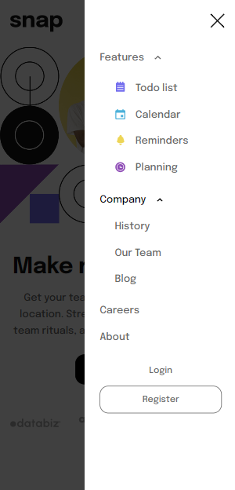

# Frontend Mentor - Intro section with dropdown navigation solution

This is a solution to the [Intro section with dropdown navigation challenge on Frontend Mentor](https://www.frontendmentor.io/challenges/intro-section-with-dropdown-navigation-ryaPetHE5).

## Table of contents

- [Overview](#overview)
  - [The challenge](#the-challenge)
  - [Screenshot](#screenshot)
  - [Links](#links)
- [My process](#my-process)
  - [Built with](#built-with)
  - [What I learned](#what-i-learned)
  - [Continued development](#continued-development)
  - [Useful resources](#useful-resources)
- [Author](#author)
- [Acknowledgments](#acknowledgments)

## Overview

### The challenge

Users should be able to:

- View the relevant dropdown menus on desktop and mobile when interacting with the navigation links
- View the optimal layout for the content depending on their device's screen size
- See hover states for all interactive elements on the page

### Screenshot




### Links

- [Live Site](https://gc31-intro-section-dropdown.netlify.app/)

## My process

### Built with

- Semantic HTML5 markup
- CSS custom properties
- Flexbox
- Vanilla JS
- Mobile-first workflow

### What I learned

I learned that dropdowns behave and are programmed similarly to accordions or tooltips, which I've done in previous projects.

I learned that what can and can't be nested under `<ul>` or `<li>` elements. I also learned that inline declaration of widths and heights are not valid if they are decimals.

To darken the page except for the activated nav on mobile, I opted to use a `<div>` that has fixed position. The darkened effect comes from `background-color` and `opacity`:

```
.dimmer {
  position: fixed;
  height: 100%;
  width: 100%;
  transition: width 0.5s, height 0.5s, background-color 0.5s;
}

.dimmer--active {
  background-color: rgba(0, 0, 0, 0.75);
}
```

This is the first time I've used `removeEventListener`. I needed it to stop the site from modifying the z-index of the dimmer component when the nav is being opened:

```
  if (dimmer.classList.contains("dimmer--active")) {
    dimmer.addEventListener("transitionend", resetIndex);
  } else {
    dimmer.style.zIndex = "1";
    dimmer.removeEventListener("transitionend", resetIndex);
  }
```

I learned that functions need to be named for `removeEventListener` to work.

I learned how to do media queries using JavaScript. I needed it to enable tab indexing for the nav items, as well as observe click away events for the dropdowns, only for tablets and desktops:

First, a variable must be declared which contains the media query:

```
var tablet = window.matchMedia("(min-width:1024px)");
```

Then, this variable's true or false state will be checked using `.matches`. This will be stored in a function:

```
function layoutShift(tablet) {
  if (tablet.matches) {
    navItem.forEach((e) => {
      enableTabIndex(e);
    });
    window.addEventListener("click", dropdownClickOutside);
  } else {
    navItem.forEach((e) => {
      disableTabIndex(e);
    });
    window.removeEventListener("click", dropdownClickOutside);
  }
}
```

The function is then called on load, and whenever the truth or falsity of it changes:

```
layoutShift(tablet);
tablet.addEventListener("change", layoutShift);
```

I also learned how to observe clicks outside an element, using `composedPath()`. I used it to collapse dropdown menu's on the desktop layout when the user clicks away from the nav:

```
function dropdownClickOutside(event) {
  const withinBoundaries = event.composedPath().includes(navLeft);

  if (!withinBoundaries) {
    dropdown.forEach((e) => {
      e.classList.remove("dropdown--active");
      resetScrollHeight(e);
    });
    dropdownArrow.forEach((e) => {
      e.classList.remove("flip");
    });
    dropdownItem.forEach((e) => {
      e.tabIndex = "-1";
    });
  }
}
```

**Update 05/30/23** - In adding accessibility to this project, I learned about `aria-expanded` and `aria-controls`. `aria-expanded` can inform screen readers whether an element, such as a button, is collapsed or not. `aria-controls` refers to the id of an element that is under control by a certain element. I controlled these values accordingly using JS:

```
<button aria-controls="dropdownCompany"
  aria-expanded="false" tabindex="-1">
  Company
  <span class="dropdown__arrow"></sp>
</button>
<ul id="dropdownCompany" aria-hidden="true">
  <li><a href="#">History</a></li>
  <li><a href="#">Our Team</a></li>
  <li><a href="#">Blog</a></li>
</ul>
```

### Continued development

I'd like to do more dropdowns, especially program what events modify them (ex. clicking away from the dropdown)

### Useful resources

- [This thread](https://stackoverflow.com/questions/12129037/correct-semantics-for-ul-in-ulm)helped me learn correct semantics for `<ul>` and `<li>`
- [This thread too.](https://stackoverflow.com/questions/11755628/can-i-use-div-as-a-direct-child-of-ul)
- [Ditto.](https://stackoverflow.com/questions/6449772/can-i-use-a-div-inside-a-list-item)
- [This thread](https://stackoverflow.com/questions/10237037/entire-drop-down-menu-quickly-flashes-upon-page-load) taught me how to prevent the mobile nav menu from flashing on load.
- [This thread](https://stackoverflow.com/questions/3772438/can-i-dynamically-set-tabindex-in-javascript) taught me how to manipulate an element's tabindex via JS.
- [This thread](https://stackoverflow.com/questions/4402287/how-can-i-remove-a-javascript-event-listener) taught me about the `removeEventListener` function.
- [Cesar Agusto's answer in this thread](https://stackoverflow.com/questions/152975/how-do-i-detect-a-click-outside-an-element) taught me how to observe click-away events using `composedPath()`.
- [This article](https://www.w3schools.com/howto/howto_js_media_queries.asp) was my basis for how to set up media queries on my script.
- [This article](https://developer.mozilla.org/en-US/docs/Web/Accessibility/ARIA/Attributes/aria-expanded) taught me about `aria-controls` and `aria-expanded`.

## Author

- [@GioCura](https://www.frontendmentor.io/profile/GioCura)

## Acknowledgments

Thanks to Zellene for checking the site out on Safari for me.
