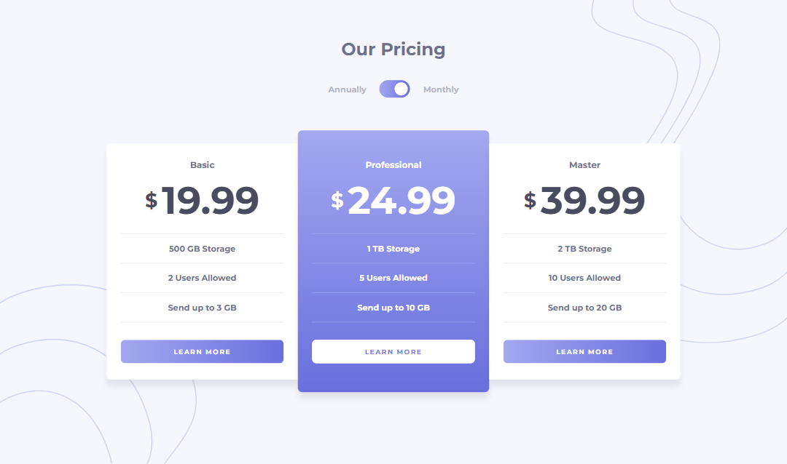
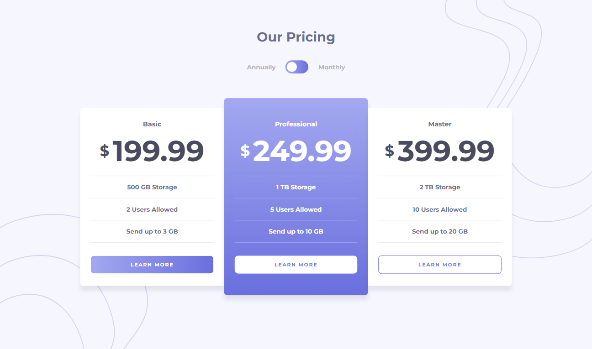
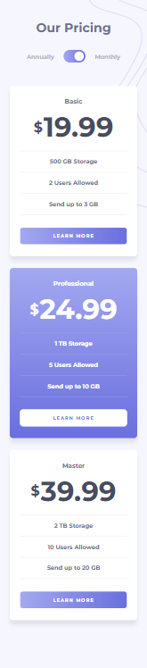

# Frontend Mentor - Pricing component with toggle solution

This is a solution to the [Pricing component with toggle challenge on Frontend Mentor](https://www.frontendmentor.io/challenges/pricing-component-with-toggle-8vPwRMIC).

## Table of contents

- [Overview](#overview)
  - [The challenge](#the-challenge)
  - [Screenshot](#screenshot)
  - [Links](#links)
- [My process](#my-process)
  - [Built with](#built-with)
  - [What I learned](#what-i-learned)
  - [Continued development](#continued-development)
  - [Useful resources](#useful-resources)
- [Author](#author)

## Overview

### The challenge

Users should be able to:

- View the optimal layout for the component depending on their device's screen size
- Control the toggle with both their mouse/trackpad and their keyboard
- **Bonus**: Complete the challenge with just HTML and CSS

### Screenshot

Desktop

Desktop-Active

Mobile


### Links

- [Live Site](https://gc24-pricing-component-toggle.com)

## My process

### Built with

- Semantic HTML5 markup
- CSS custom properties
- Flexbox
- Mobile-first workflow
- Vanilla JS

### What I learned

The scripting for this project was more straightforward than I expected. I got to review `keydown` event listeners, because I needed to link the custom toggle I made using `button` to the `input` (which was set to `display: none`).

Along the way, I learned that I had to disable the button's default behavior of refreshing the page upon click. I used `pointer-events: none` and `type="button"`.

To make the custom toggle activate the input, I used the `click()` function in my script:

```
planButtonEl.addEventListener("keydown", (e) => {
  if (e.key === " " || e.key === "Enter") {
    planInputEl.click();
  }
});
```

In conveying the price toggle, I decided to use `transform` properties to shift the prices to the side:

```
.card__price--monthly {
  transform: translate(-100%, -100%);
  transition: all 0.3s ease-in-out;
  opacity: 0;
}

.monthly .card__price--monthly {
  transform: translate(0%, -100%);
  opacity: 1;
}
```

I also discovered that I didn't need to use absolute positioning anymore as long as I gave a set height to the nesting element of both prices. The `transform` takes care of the rest.

### Continued development

- It'd help me to do more challenges involving JS.

### Useful resources

- [This website](https://www.toptal.com/developers/keycode/space) contains all the keycodes. I used it when setting rules for my keydown script.

## Author

- Frontend Mentor - [@GioCura](https://www.frontendmentor.io/profile/GioCura)
