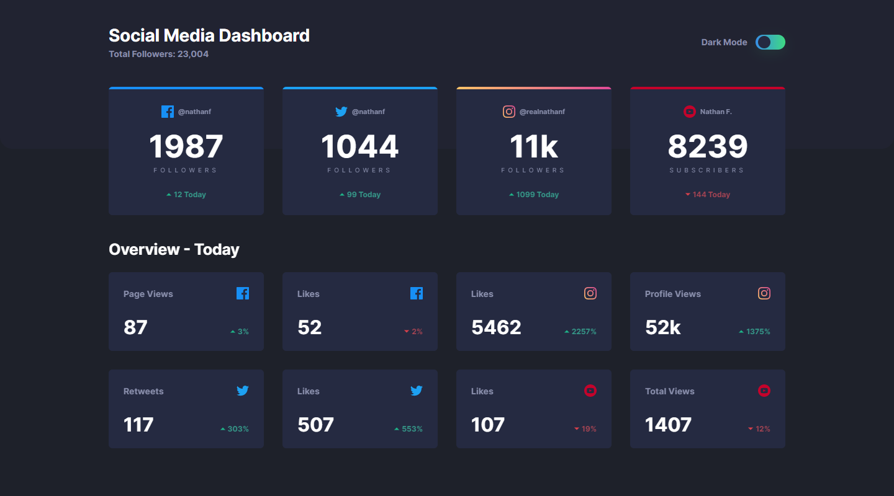
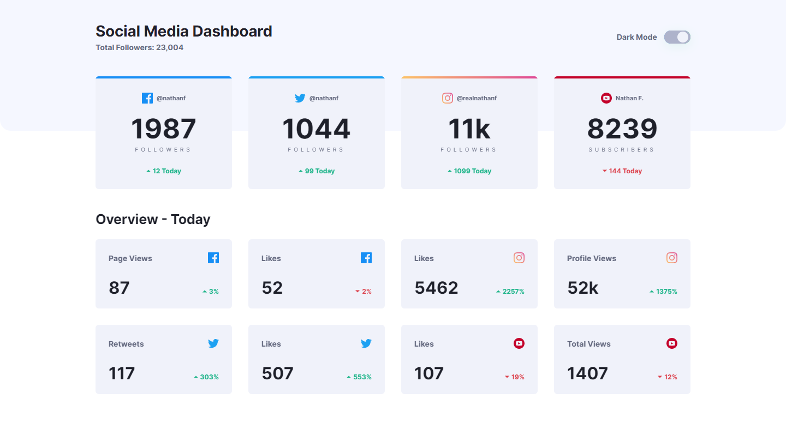
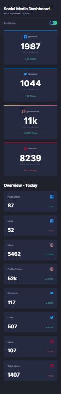
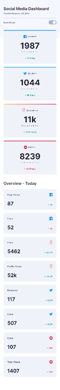

# Frontend Mentor - Social media dashboard with theme switcher solution

This is a solution to the [Social media dashboard with theme switcher challenge on Frontend Mentor](https://www.frontendmentor.io/challenges/social-media-dashboard-with-theme-switcher-6oY8ozp_H).

## Table of contents

- [Overview](#overview)
  - [The challenge](#the-challenge)
  - [Screenshot](#screenshot)
  - [Links](#links)
- [My process](#my-process)
  - [Built with](#built-with)
  - [What I learned](#what-i-learned)
  - [Continued development](#continued-development)
  - [Useful resources](#useful-resources)
- [Author](#author)
- [Acknowledgments](#acknowledgments)

## Overview

### The challenge

Users should be able to:

- View the optimal layout for the site depending on their device's screen size
- See hover states for all interactive elements on the page
- Toggle color theme to their preference

### Screenshot

Desktop - Dark

Desktop - Light

Mobile - Dark

Mobile - Light


### Links

- [Live Site](https://gc26-social-dashboard-theme-switcher.netlify.app/)

## My process

### Built with

- Semantic HTML5 markup
- CSS custom properties
- Flexbox
- CSS Grid
- Vanilla JS
- Mobile-first workflow

### What I learned

I learned quite a lot doing this project, and implementing the extra animations.

Mainly, I learned to make utility classes and split my style folders due to how many more lines of code I wrote.

In writing the code itself, I got a lot of practice using combined selectors, pseudoclasses & elements, and animations.

Coding the theme switch was straightforward enough . It only required a toggle that adds an active class. Since this is a theme change, I set the class right on the `<body>`:

```
function toggleTheme() {
  document.body.classList.toggle("light");
}
```

All the style changes were made using the active class in combined selectors. I made a separate stylesheet for it.

In making the toggle's ripple effect, I learned that I could assign the ripple style to the `input` which is virtually hidden because its `width` is set to `0`. Despite that, the ripple will still show if I apply the style to the pseudoelements of its `:checked` and `:not(:checked)` states:

```
.darkmode__input:checked::after,
.darkmode__input:not(:checked)::before {
  bottom: -2.2rem;
  left: -2.6rem;
  border-radius: 50%;
  box-shadow: 0px 2px 30px hsla(146, 68%, 55%, 0.8);
  animation: 0.8s ripple;
}
```

The `keyframes` causes the ripple to expand and slowly fade out. I just have to keep in mind to recenter the ripple at its widest state:

```
@keyframes ripple {
  0% {
    width: 5rem;
    height: 5rem;
    opacity: 0.45;
  }
  100% {
    height: 8rem;
    width: 8rem;
    opacity: 0;
    bottom: -3.3rem;
    left: -4rem;
  }
}
```

However, since the animation happens at both checked and unchecked states, it fires immediately on load. The solution I made for this is to momentarily hide the `input` on-load via `keyframes`:

```
@keyframes hideRipple {
  0% {
    opacity: 0;
  }
  99% {
    opacity: 0;
  }
  100% {
    opacity: 1;
  }
}
```

Flipping the cards themselves on-load was simple enough by using `transform: rotateX()` on the `keyframes`, as well as some well-timed `opacity` parameters. The problem was that the `transform` was causing the elements of the card to shift by a few pixels.

Eventually, I learned to counteract this by setting `will-change: transform` to the shifting elements. This attribute gives the broswer a hint of how a given element will render. Since `will-change` takes up a lot of resources, I made a script to reset it after a given time:

```
function renderFix() {
  timeout = setTimeout(function () {
    renderFixEl.forEach((e) => {
      e.style.willChange = "auto";
    });
  }, 5000);
}
```

But this wasn't enough. Triggering the light theme after the `will-change` is reset to `auto` will still result in some shifting. To fix this, I added event listeners that set the value from transform to auto whenever the user interacts with the toggle.

The below code reinstates the `transform` value. Note that it cancels the timeout to change the value to `auto` when the user mouses or focuses out of the toggle.

```
["mouseover", "focusin"].forEach(function (e) {
  darkmodeToggleEl.addEventListener(e, function () {
    clearTimeout(timeout);
    renderFixEl.forEach((e) => {
      e.style.willChange = "transform";
    });
  });
});
```

This also taught me how to bind two events to one listener.

I learned, too, that clicking on an object results in loss of focus. To counteract this, I manually reinstated the focus state upon activation of the toggle:

```
darkmodeInputEl.addEventListener("change", function () {
  toggleTheme();
  darkmodeToggleEl.focus();
});
```

All this rendering and animation, however, made the site jittery on Safari. I learned to counteract this by making a style declaration at the top of the `<head>` that hides the `html`...

```
  <head>
    <style>
      html {
        display: none;
        visibility: hidden;
      }
    </style>
```

...which is then countered by a declaration in my main stylesheet:

```
html {
  display: block;
  visibility: visible;
}
```

Doing this hides the site's contents until the browser can start reading the stylesheet. I'll be reusing it for projects that require a lot of animations.

Another funky glitch I only encountered on Safari was that the `input` was still visibile even with `width: 0`. Since it's next to the toggle anyway, I just pushed it behind that:

```
.darkmode__input {
  transform: translateX(3rem);
}
```

I went back to this project again to make a workaround for the :has pseudoclass, which isn't available for Firefox. I was using it to change the "Dark Mode" title when the form is hovered.
I tried doing this:

```
.darkmode__form:hover ~ .darkmode__title {
  color: var(--darktext2);
}
```

However, it wasn't working because, in the html, the title came first before the form. Instead, I found out that I could write the form first before the title and, since their nesting class is a flex item, I can just reorder them:

```
.darkmode__title {
  order: 1;
}

.darkmode__form {
  order: 2;
}
```

Another thing I learned about Firefox is that pseudoelements aren't enabled for checkboxes by default. To workaround this, I learned to set `-moz-appearance: initial` to the checkbox element.

### Continued development

- I want to practice building larger projects that requires me to refactor and make helper classes.

### Useful resources

- I based my toggle's ripple effect on [@frontendcharm's ripple radio button](https://www.instagram.com/frontendcharm/).
- [This stackoverflow question](https://stackoverflow.com/questions/3221561/eliminate-flash-of-unstyled-content) helped me understand how to workaround the flash of unstyled content.
- [This stackoverflow question](https://stackoverflow.com/questions/14729492/css3-transform-rotate-causing-1px-shift-in-chrome) led me to discovering the `will-change` attribute, which solved the site's rendering bug.
- [The MDN page about `will-change`](https://developer.mozilla.org/en-US/docs/Web/CSS/will-change) taught me to remove said attribute once I no longer need it.
- [The stackoverflow thread](https://stackoverflow.com/questions/8796988/binding-multiple-events-to-a-listener-without-jquery) taught me to how to bind two events to a listener.
- [This w3schools article](https://www.w3schools.com/jsref/met_win_cleartimeout.asp) taught me how to write a timeout function so that it can be called upon by `clearTimeout()`
- [The stackoverflow thread](https://stackoverflow.com/questions/35378360/before-after-pseudo-elements-not-showing-firefox) taught me to how to enable pseudoelements for checkboxes on Firefox.
- [The stackoverflow thread](https://stackoverflow.com/questions/1817792/is-there-a-previous-sibling-selector) taught me to use flex `order` as a workaround in situations where I want to select preceding siblings.

## Author

- Frontend Mentor - [@GioCura](https://www.frontendmentor.io/profile/GioCura)

## Acknowledgments

Thank you to Zellene for helping me debug the site on Safari.
