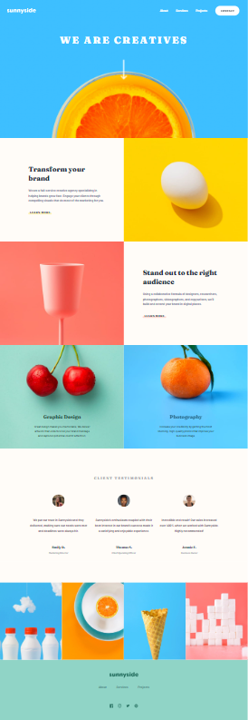
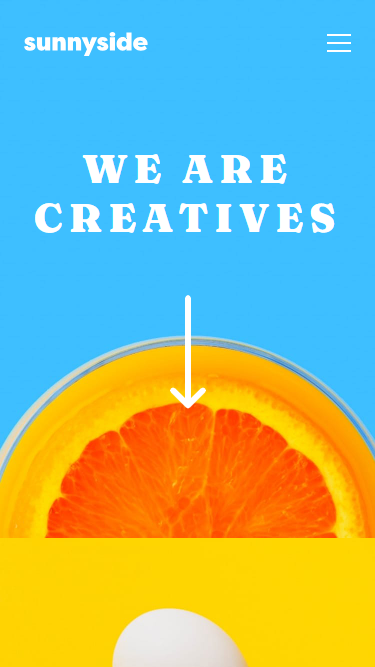
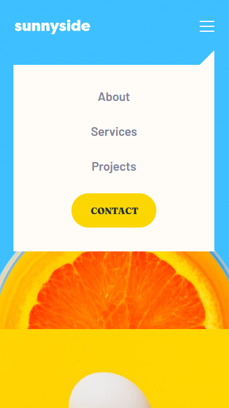

# Frontend Mentor - Sunnyside agency landing page solution

This is a solution to the [Sunnyside agency landing page challenge on Frontend Mentor](https://www.frontendmentor.io/challenges/sunnyside-agency-landing-page-7yVs3B6ef).

## Table of contents

- [Overview](#overview)
  - [The challenge](#the-challenge)
  - [Screenshot](#screenshot)
  - [Links](#links)
- [My process](#my-process)
  - [Built with](#built-with)
  - [What I learned](#what-i-learned)
  - [Continued development](#continued-development)
- [Author](#author)

## Overview

### The challenge

Users should be able to:

- View the optimal layout for the site depending on their device's screen size
- See hover states for all interactive elements on the page

### Screenshot

### Links

- [Live Site](https://gc33-sunnyside-landing.netlify.app/)

## My process

### Built with

- Semantic HTML5 markup
- CSS custom properties
- Flexbox
- CSS Grid
- Vanilla JS
- Mobile-first workflow

### What I learned

I took this on because I wanted more practice handling a full landing page.

Although not required, I added a sticky header with the same technique I used on my first ever project.

This time I learned that `scroll-behavior: smooth` is more widely adapted by browsers, so I opted to use that instead of the custom script I made in my previous project.

### Continued development

If I had the chance, I would have liked to work with more modern image file formats like webp. Also, I'd like to try more advanced methods of lazy loading.

## Author

- [@GioCura](https://www.frontendmentor.io/profile/GioCura)
