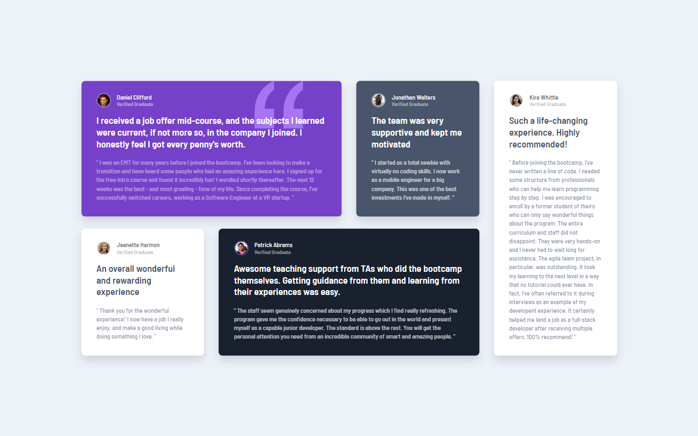

# Frontend Mentor - Testimonials grid section solution

This is a solution to the [Testimonials grid section challenge on Frontend Mentor](https://www.frontendmentor.io/challenges/testimonials-grid-section-Nnw6J7Un7).

## Table of contents

- [Overview](#overview)
  - [The challenge](#the-challenge)
  - [Screenshot](#screenshot)
  - [Links](#links)
- [My process](#my-process)
  - [Built with](#built-with)
  - [What I learned](#what-i-learned)
  - [Continued development](#continued-development)
  - [Useful resources](#useful-resources)
- [Author](#author)

## Overview

### The challenge

Users should be able to:

- View the optimal layout for the site depending on their device's screen size

### Screenshot




### Links

- [Live Site](https://gc25-testimonials-grid.netlify.app)

## My process

### Built with

- Semantic HTML5 markup
- CSS custom properties
- Flexbox
- CSS Grid
- Mobile-first workflow

### What I learned

- In making the desktop layout, I found that it was crucial to give each column `1fr` so that the cards would take up all the available space in the grid.

- Once that was solved, I decided to have some fun and add some animations. First, the onload animation were done via `keyframes` and the `transform` attribute.

- However, that animation was choppy because the `transform` was causing the body to get bigger, and thus produce scrollbars. I set the body to `overflow: hidden` however, that disables the ability of the viewer to scroll the page when zoomed in.

- So, I figured setting `overflow: hidden` only on load would work. Again, I used keyframes:

```
  @keyframes overflow {
    0% {
      overflow: hidden;
    }
    99% {
      overflow: hidden;
    }
    100% {
      overflow: visible;
    }
  }
```

- Aside from making the cards scale up on hover, I decided to make some animated borders. I learned that this could be done by using pseudoelements whose width starts at 0, then goes to 100% on hover:

```
  .card::before,
  .card::after {
    content: "";
    position: absolute;
    width: 0;
    border: 3px solid transparent;
    transition: all 0.5s;
  }

  .card::before {
    bottom: -0.1rem;
    right: 0;
  }

  .card::after {
    top: -0.1rem;
    left: 0;
  }

  .card:hover::after,
  .card:hover::before {
    width: 100%;
    border: 3px solid gold;
  }
```

- Although I decided not to implement it, I also learned how to make borders that animate from the center. It involves initially setting it to `50%` `left` or `right`, then setting it to `0` alongside making the `width` `100%` on hover.

- I returned to this after my experiences with rendering issues in my [succeeding one](https://github.com/GioCura/Frontend-Mentor-Projects/tree/main/Junior/Social-Media-Dashboard-With-Theme-Switcher). I implemented the same fixes via javascript.

### Continued development

- I need more understanding and using `1fr` for grids.

- More custom animations!

### Useful resources

- [This forum thread](https://teamtreehouse.com/community/difference-between-fr-unit-and-auto-value-on-grid-item#:~:text=Since%20the%20browser%20found%20a,%2C%20currently%20just%20a%20number) helped me understand that setting `1fr` on a grid column, will let it take all the available space, whereas `auto` will give it just enough to fit.
- [This stackoverflow question](https://stackoverflow.com/questions/55398733/start-css-underline-animation-from-center-instead-of-left) helped me understand how to make custom animated underlines.

## Author

- Frontend Mentor - [@GioCura](https://www.frontendmentor.io/profile/GioCura)

```

```
