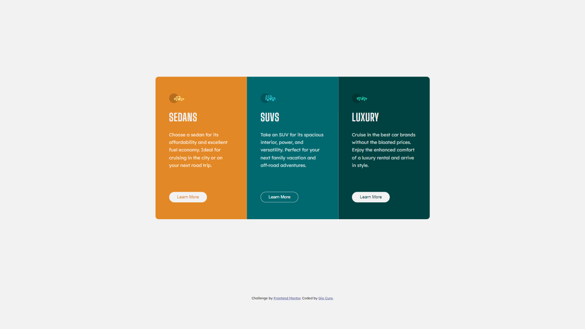

# Frontend Mentor - 3-column preview card component solution - 02/21/23

This is a solution to the [3-column preview card component challenge on Frontend Mentor](https://www.frontendmentor.io/challenges/3column-preview-card-component-pH92eAR2-).

## Table of contents

- [Overview](#overview)
  - [The challenge](#the-challenge)
  - [Screenshot](#screenshot)
  - [Links](#links)
- [My process](#my-process)
  - [Built with](#built-with)
  - [What I learned](#what-i-learned)
  - [Continued development](#continued-development)
- [Author](#author)

## Overview

### The challenge

Users should be able to:

- View the optimal layout depending on their device's screen size
- See hover states for interactive elements

### Screenshot

Desktop

Mobile

### Links

- [Live Site](https://gc7-3columnpreview.netlify.app)

## My process

### Built with

- HTML
- CSS
- Flexbox
- Mobile-first workflow
- (Updated 02/25/2023) - BEM

### What I learned

- I learned not to worry so much about precisely setting line breaks anymore. There were three card texts I had to take care of!

- I remembered to add a `border` on the `button` itself, and not the `hover` state. I only gave it a color on `hover`.

- I spend the longest time figuring out how to set the `border-radius` here. I initially thought that setting that attribute to each card's shared class would do the trick, but it ended up giving the each indivual card's corners a curve.

- Eventually, I figured out that you can set each corner's `border-radius`. I learned how to write it in shorthand to make the code neat!

### Continued development

- One major mistake here, I forgot to universally set `margin` and `padding` to 0. I mistakenly put those attributes in the html tag. I edited the code with that now.

- I'll remember not to do that again.

## Author

- Frontend Mentor - [@GioCura](https://www.frontendmentor.io/profile/GioCura)
