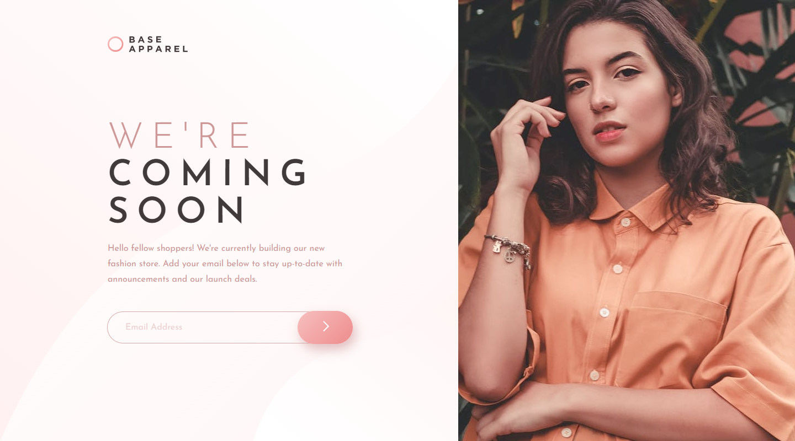
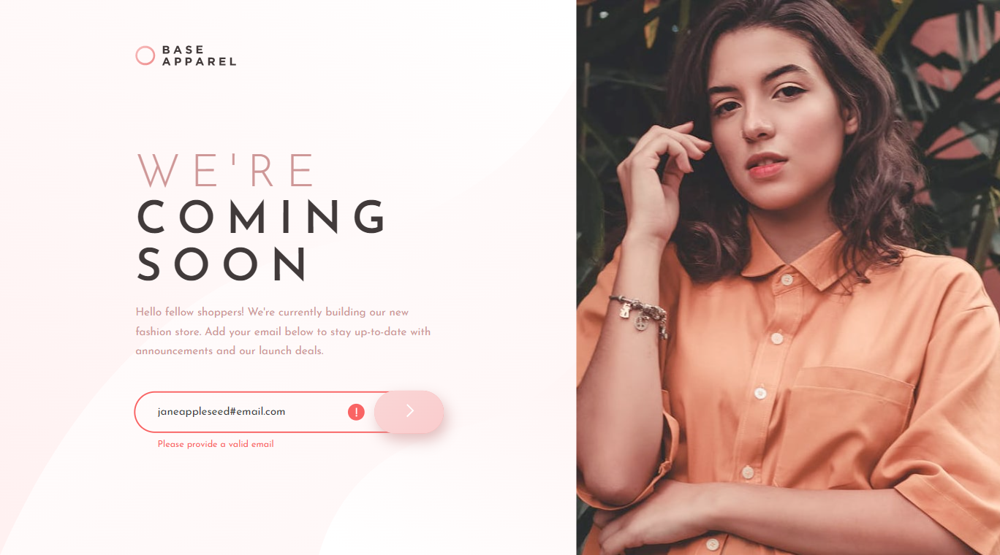
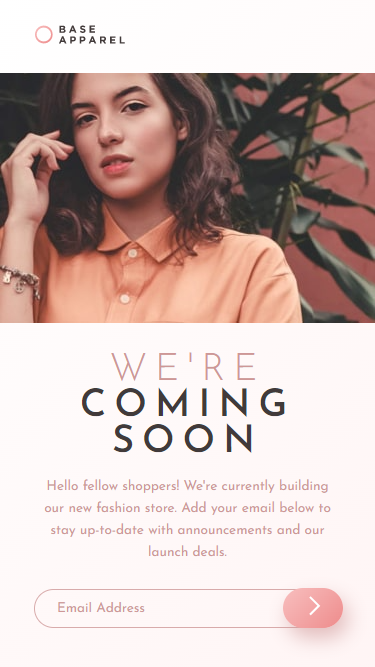

# Frontend Mentor - Base Apparel coming soon page solution

This is a solution to the [Base Apparel coming soon page challenge on Frontend Mentor](https://www.frontendmentor.io/challenges/base-apparel-coming-soon-page-5d46b47f8db8a7063f9331a0).

## Table of contents

- [Overview](#overview)
  - [The challenge](#the-challenge)
  - [Screenshot](#screenshot)
  - [Links](#links)
- [My process](#my-process)
  - [Built with](#built-with)
  - [What I learned](#what-i-learned)
  - [Continued development](#continued-development)
  - [Useful resources](#useful-resources)
- [Author](#author)
- [Acknowledgments](#acknowledgments)

*

## Overview

### The challenge

Users should be able to:

- View the optimal layout for the site depending on their device's screen size
- See hover states for all interactive elements on the page
- Receive an error message when the `form` is submitted if:
  - The `input` field is empty
  - The email address is not formatted correctly

### Screenshot

Desktop

Desktop Active

Mobile

### Links

- [Live Site](https://gc21-base-coming-soon.netlify.app)

## My process

### Built with

- Semantic HTML5 markup
- CSS custom properties
- Flexbox
- CSS Grid
- Vanilla JS
- Mobile-first workflow

### What I learned

I learned a lot more than I expected in this challenge! I found `grid-template-areas` very useful in laying out my `header`, `main`, and `image` properly on desktop.

I also learned a way to responsively center cell content using `justify-self`. This proved helpful in making sure that the margins beside my header and hero text were appropriately sized.

This is also my first time making an `input` with a button inside it. I learned that one way to do this is to nest the `input` and the button`, remove the `input'`s outline, and then have the nesting element house the outline.

On that note, I also learned the difference between `outline` and `border`. I tried using `border` initially, but found out that it nudges the hero text above it if it gets bigger, as the design requires. `Outline` doesn't occupy space, so this nudging effect doesn't happen.

With a more complex `input` layout, I had to control more elements when the error state triggers. I found the general sibling combinator `~` useful in this project, because I'm selecting a lot of siblings of the input element.

On that note, I also used the `:has` pseudoclass to select the `input`'s nesting div. This is quite useful, but I'm aware that it's not yet adapted by all browsers.

For the validation message, I reused my code from previous projects. This time, I added a message that notifies the user if the email has been successfully received.

### Continued development

More responsive landing components using CSS grid.

### Useful resources

- [This article](https://blog.logrocket.com/how-create-double-border-css/#:~:text=To%20create%20a%20double%20border%2C%20the%20double%20keyword%20value%20is,specific%20side%20of%20an%20element.) taught me how the `outline` property differs from the `border` property.
- [This article](https://usefulangle.com/post/131/css-select-siblings#:~:text=The%20~%20character%20combinator%20combines%202,followed%20after%20the%20first%20element.) taught me about the `~` general sibling combinator.
- [This article](https://www.geeksforgeeks.org/how-to-put-a-responsive-clear-button-inside-html-input-text-field/) taught me how to style the input form with a button inside it.

## Author

- Frontend Mentor - [@GioCura](https://www.frontendmentor.io/profile/GioCura)

## Acknowledgments

[@ecemgo's](https://www.frontendmentor.io/profile/ecemgo) [solution](https://www.frontendmentor.io/solutions/responsive-page-with-email-validation-and-typing-animation-CtAjvyA_hj) helped me realize how to stack the color and background illustration for the desktop version.
