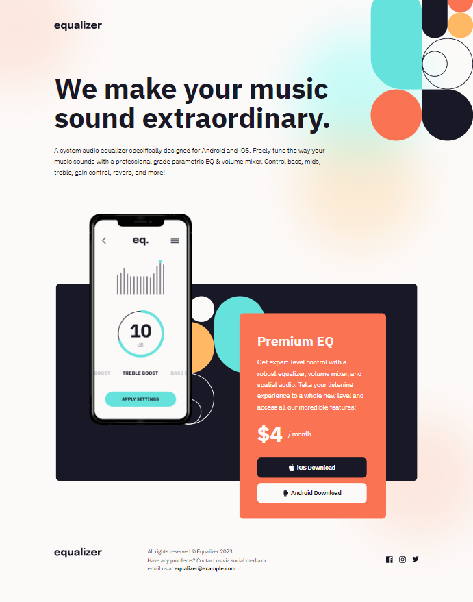
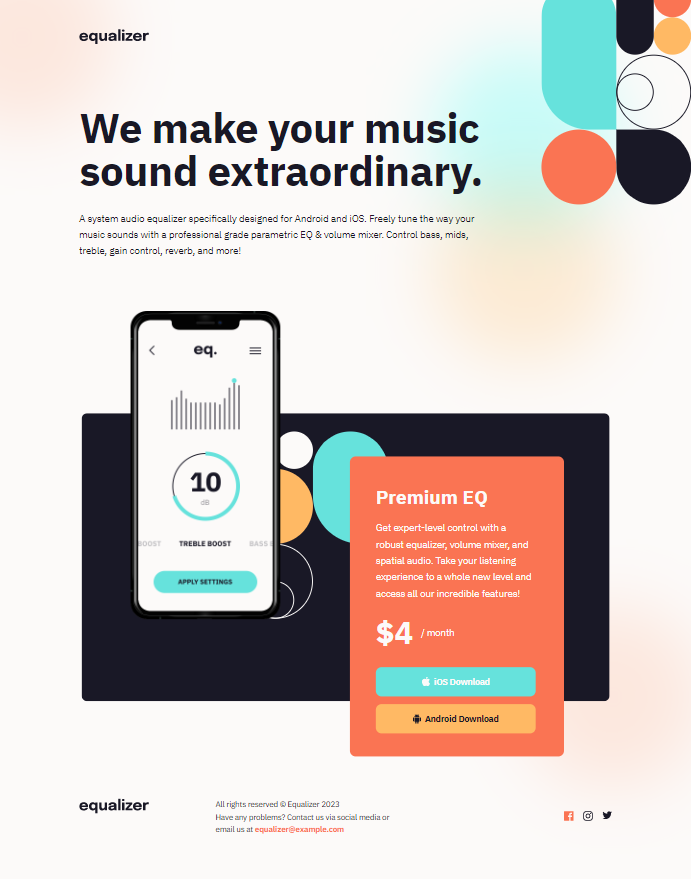
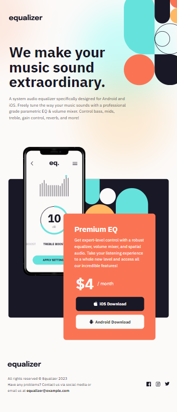
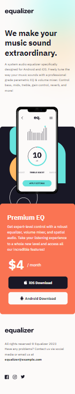

# Frontend Mentor - Equalizer landing page solution

This is a solution to the [Equalizer landing page challenge on Frontend Mentor](https://www.frontendmentor.io/challenges/equalizer-landing-page-7VJ4gp3DE).

## Table of contents

- [Overview](#overview)
  - [The challenge](#the-challenge)
  - [Screenshot](#screenshot)
  - [Links](#links)
- [My process](#my-process)
  - [Built with](#built-with)
  - [What I learned](#what-i-learned)
  - [Continued development](#continued-development)
  - [Useful resources](#useful-resources)
- [Author](#author)
- [Acknowledgments](#acknowledgments)

## Overview

### The challenge

Users should be able to:

- View the optimal layout depending on their device's screen size
- See hover states for interactive elements

### Screenshot

Desktop

Desktop - Active

Tablet

Mobile


### Links

- [Live Site](https://gc29-equalizer-landing.netlify.app/)

## My process

### Built with

- Semantic HTML5 markup
- CSS custom properties
- Flexbox
- CSS Grid
- Vanilla JS
- Mobile-first workflow

### What I learned

I took this challenge on because I've not done a lot of landing pages. Also, I wanted to learn how to write the CSS for the call-to-action here.

I nested the phone illustration and card in a div, which served as the dark blue background. Both nested elements are absolutely positioned, and a margin was added to the nesting div to contain the overflow. I learned to nest all of them in a flexed item, so that this margin will be followed (i.e. the preceding header does not overlap the phone illustration).

I learned to animate elements on load as well as on scroll, using intersectionObserver and helper classes.

For the hero:

```
window.addEventListener("load", function () {
  heroEl.classList.remove("hidden");
});
```

For the succeeding elements, on scroll:

```
let options = {
  threshold: 0.6,
};

const observer = new IntersectionObserver((entries) => {
  entries.forEach((entry) => {
    if (entry.isIntersecting) {
      entry.target.classList.remove("hidden-up");
      entry.target.classList.remove("hidden-left");
      entry.target.classList.remove("hidden-right");
    }
  });
}, options);
hiddenLazy.forEach((el) => {
  observer.observe(el);
});
```

### Continued development

- I'd like to do more landing pages, for they are a good practice for lazy-loading.

### Useful resources

- [This video by Beyond Fireship](https://www.youtube.com/watch?v=T33NN_pPeNI&list=LL&index=2) taught me how to animate things on scroll.
- [The main answer to this SO question](https://stackoverflow.com/questions/1033398/how-to-execute-a-function-when-page-has-fully-loaded) taught me how to trigger a function when the whole page has fully loaded.

## Author

- Frontend Mentor - [@GioCura](https://www.frontendmentor.io/profile/GioCura)

## Acknowledgments

Thanks to Zellene for helping me test the site on Safari.
