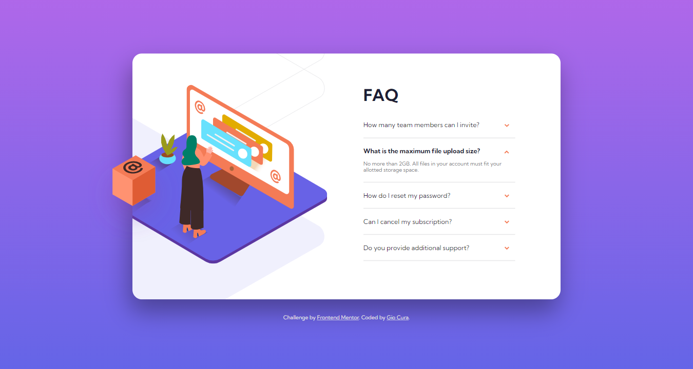
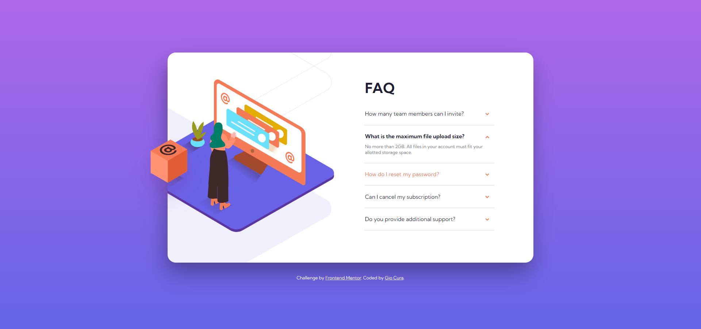
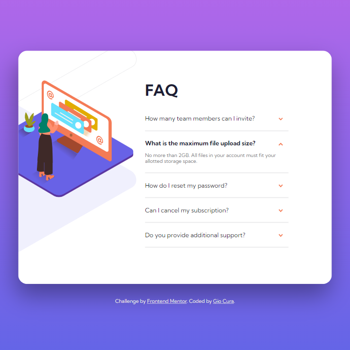

# Frontend Mentor - FAQ accordion card solution

This is a solution to the [FAQ accordion card challenge on Frontend Mentor](https://www.frontendmentor.io/challenges/faq-accordion-card-XlyjD0Oam).

## Table of contents

- [Overview](#overview)
  - [The challenge](#the-challenge)
  - [Screenshot](#screenshot)
  - [Links](#links)
- [My process](#my-process)
  - [Built with](#built-with)
  - [What I learned](#what-i-learned)
  - [Continued development](#continued-development)
  - [Useful resources](#useful-resources)
- [Author](#author)

## Overview

### The challenge

Users should be able to:

- View the optimal layout for the component depending on their device's screen size
- See hover states for all interactive elements on the page
- Hide/Show the answer to a question when the question is clicked

### Screenshot

Screenshot - Desktop

Screenshot - Desktop Active

Screenshot - Tablet

Screenshot - Mobile

### Links

- [Live Site](https://gc11-faq-accordion.netlify.app/)

## My process

### Built with

- Semantic HTML5 markup
- CSS custom properties
- Flexbox
- Mobile-first workflow
- JavaScript

### What I learned

- The accordion:

  - How did I nest the hidden content?

    - The hidden content are siblings with question, the former's height/`max-height` being `0`.

  - How did I reveal the content?

    - Via an ``addEventListener` whose function on click is to change the `max-height`.

    - The `max-height` was calculated via JavaScript, by making the element's height equal to it's `scrollHeight` on trigger.

  - How did I collapse the rest of the answers?

    - I implemented a `forEach` statement inside my click `addEventListener`. The statement is a condition that removes the active class from all items, then sets the active class on the single element that was clicked.

  - How did I animate the reveal?

    - For the answer itself, two ways:

      - The `max-height` transition
      - A `keyframe` that happens when the active class is added to the element.

    - For the arrow, I rotated it via `transform`.

- Mobile layout:

  - The height of the card was based on the mockup while the second question was opened. Getting that height from the chrome developer, I explicitly declared it as the card's `height`.

  - The `width` was not explicitly set for the mobile version. A `margin` to the sides were added to make sure that the card doesn't touch the edges of the screen.

  - How did I position the illustrations:

    - The two images were nested in an imagebox.

    - Each illustration was given a `z-index` lower/higher than the other, because they overlap.

    - The image box was given an explicit `width`, to account for its children being absolutely positioned.

    - The image box was aligned to the `center`. This is key to keeping the illustrations centered even when the window is resized.

- Tablet/Desktop Layout

  - Both the `width` and `height` are given set values.

  - How did I deal with the box overflowing the card while the rest of the illustrations didn't?

    - The images of the mobile version were set to `display: none`, and instead the desktop illustrations were implemented as `background-image` within the imagebox.

    - I learned that, for accessibility purposes, decorative illustratoins like these should be `background-images` anyway, to avoid search engines from scraping their content. That is, only the main content of the page should be gotten.

  - How did I make the layout responsive?

    - As the imagebox has no inline content, the width just collapses, until it reverts back to the mobile layout.

    - The two `background-images`' sizes were set through `clamp()`. This makes the images shrink and expand depending on the viewport size.

    - Via `opacity`, the box was triggered to show only once the illustration has reached its `max-width`.

### Continued development

- It will be helpful if I did more accordion components, and layouts involving `background-images` and absolutely-positioned elements.

- I definitely need more practice on using `clamp()`.

- This is my most responsive project to date, and I want to take it further from here.

### Useful resources

- [This video by Developer Empire](https://www.youtube.com/watch?v=4qnWreynXLU) which taught me how to make an accordion with basic transition animations!

- [This article by Abdulqudus Abubakre](https://dev.to/ibn_abubakre/responsive-css-width-2jnm) which enlightened me more on how max-width works!

- [This article by Mate Vegh](https://medium.com/mirum-budapest/back-to-the-basics-accordions-5aab4a678b3b) which described a quick way to get an accordion element's height via JS!

- [This question answered by Dylan Hayes](https://stackoverflow.com/questions/16194737/apply-background-size-to-individual-layer-of-a-multiple-background) helped me understand how to use multiple images for background-image!

## Author

- Frontend Mentor - [@GioCura](https://www.frontendmentor.io/profile/GioCura)

## Acknowledgments

Thanks to Zellene for always helping me check my projects' functionality on Apple devices and browsers. :)
