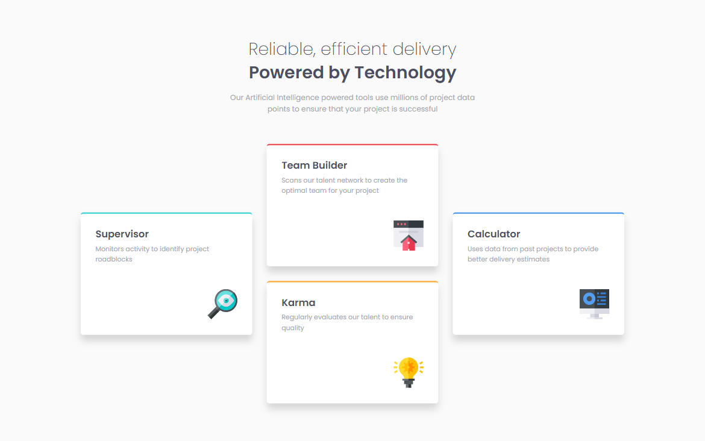
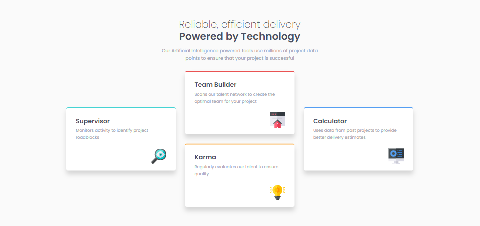
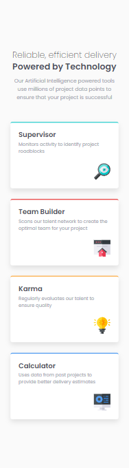

# Frontend Mentor - Four card feature section solution

This is a solution to the [Four card feature section challenge on Frontend Mentor](https://www.frontendmentor.io/challenges/four-card-feature-section-weK1eFYK).

## Table of contents

- [Overview](#overview)
  - [The challenge](#the-challenge)
  - [Screenshot](#screenshot)
  - [Links](#links)
- [My process](#my-process)
  - [Built with](#built-with)
  - [Continued development](#continued-development)
  - [Useful resources](#useful-resources)
- [Author](#author)
- [Acknowledgments](#acknowledgments)

## Overview

### The challenge

Users should be able to:

- View the optimal layout for the site depending on their device's screen size

### Screenshot

Desktop

Small Laptops/Tablets in Landscape

Mobile

### Links

- [Live Site](https://gc16-4card-feature.netlify.app)

## My process

### Built with

- Semantic HTML5 markup
- CSS custom properties
- Flexbox
- Mobile-first workflow

### Continued development

- Making this project was straightforward, as I already know that I can achieve the card layout by using flex.

- Again, most of my effort went into making this responsive. At first, I thought about setting the cards all into a single row, but that didn't look good in my opinion. I eventually figured out that I could just set `clamp` to the cards' height.

- Really, I feel like this would have been a great opportunity to practice grid.

## Author

- Frontend Mentor - [@GioCura](https://www.frontendmentor.io/profile/GioCura)

## Acknowledgments

Thanks to Zellene, for always keeping me sane.
