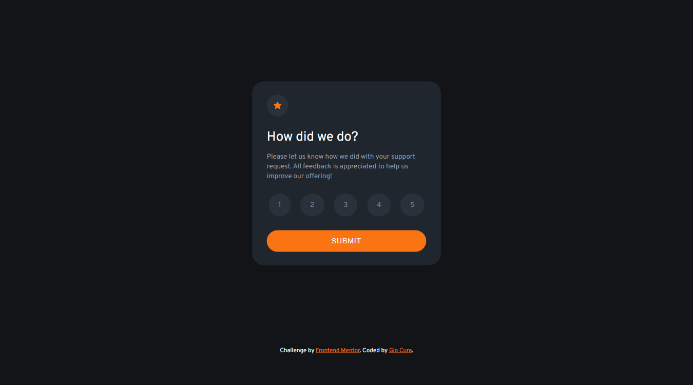
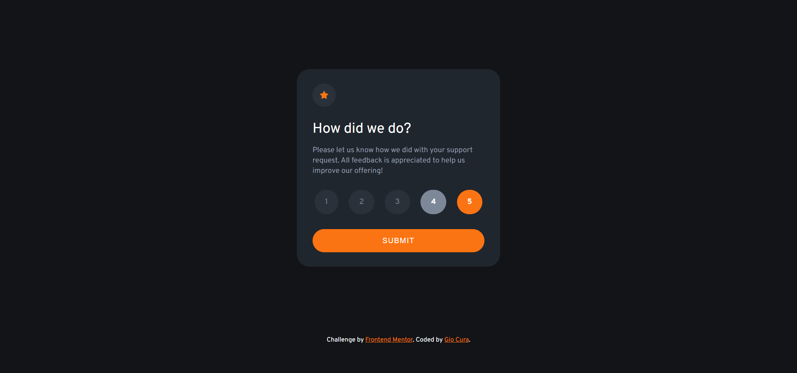
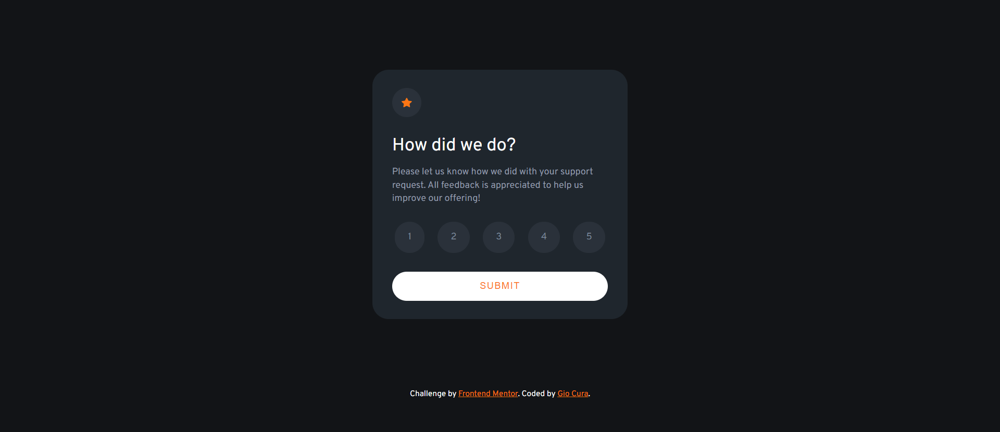
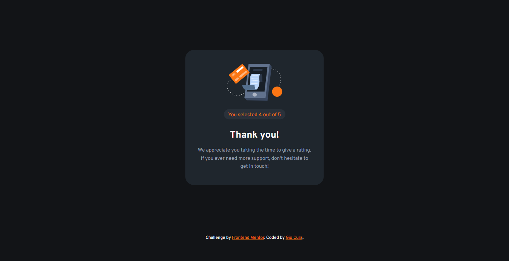
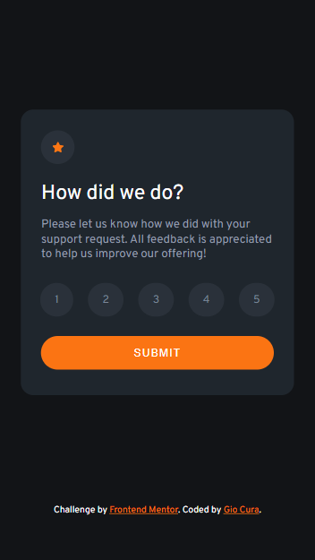

# Frontend Mentor - Interactive rating component solution

This is a solution to the [Interactive rating component challenge on Frontend Mentor](https://www.frontendmentor.io/challenges/interactive-rating-component-koxpeBUmI).

## Table of contents

- [Overview](#overview)
  - [The challenge](#the-challenge)
  - [Screenshot](#screenshot)
  - [Links](#links)
- [My process](#my-process)
  - [Built with](#built-with)
  - [What I learned](#what-i-learned)
  - [Continued development](#continued-development)
  - [Useful resources](#useful-resources)
- [Author](#author)

## Overview

### The challenge

Users should be able to:

- View the optimal layout for the app depending on their device's screen size
- See hover states for all interactive elements on the page
- Select and submit a number rating
- See the "Thank you" card state after submitting a rating

### Screenshot

Desktop

Desktop - Active

Desktop - Submit

Desktop - Thank You

Mobile

### Links

- [Live Site URL](https://gc10-interactive-rating.netlify.app)

## My process

### Built with

- Semantic HTML5 markup
- CSS + custom properties
- BEM
- Flexbox
- JavaScript
- Mobile-first workflow

### What I learned

- I haven't done forms in a long while, so this is a nice review. I remembered that:

  - `forms` need a name
  - inputs`need a`type`, `id`, and `name`
  - to make a single radio button selectable out of a set, all of them must share the same `name`
  - `labels` are good for accessibility, because clicking on anything nested under a label will select the input

- I learned that `labels` are good when making custom radio buttons. I have to set the `input`s to display: none`.

- The `input`'s `active` state is called `selected`. This is different from `hover`.

- The `button` for a `form` can be an `input` that is typed `button` or a `button` that is typed `submit` I used the latter.

- I learned that I should order my stylings by positioning, box model, typography, and visuals.

- This is the first functional `form` project I've done outside of my JavaScript udemy courses (which I haven't finished yet 😋). So I've learned a lot of things:

  - That buttons with type `submit` can be called upon by an addEventListener.

  - That popups can be made using `alert()`

  - That states along with classes can be selected in JS (ex. an `input` as it is checked.)

  - That variables that change (ex. the state of a radio button being checked), should be declared with `let`, not `const`

  - That variables that are `null` on load (ex. the variable for the radio button being checked), would result in an error if declared on load.

    - They should be declared after, somehow (ex. as the result of an `addEventListener`).

  - That `==` and `===` should be used for conditionals. The latter, especially, because it's "stricter."

### Continued development

- I definitely need to do different forms of different styles. These are very important components to websites.

- More JavaScript!

### Useful resources

- [This stackoverflow post](https://stackoverflow.com/questions/45259139/how-to-put-text-inside-radio-button) taught me how to make custom radio buttons in a simple way.

- [This freecodeCamp article](https://www.freecodecamp.org/news/how-to-submit-a-form-with-javascript/) guided me on making the javascript functionality for this project.

- [This other stackverflow post](https://stackoverflow.com/questions/1423777/how-can-i-check-whether-a-radio-button-is-selected-with-javascript), specifically Neri's post, for teaching me a very simple way to check if my radio buttons were selected.

## Author

- Frontend Mentor - [@GioCura](https://www.frontendmentor.io/profile/GioCura)
