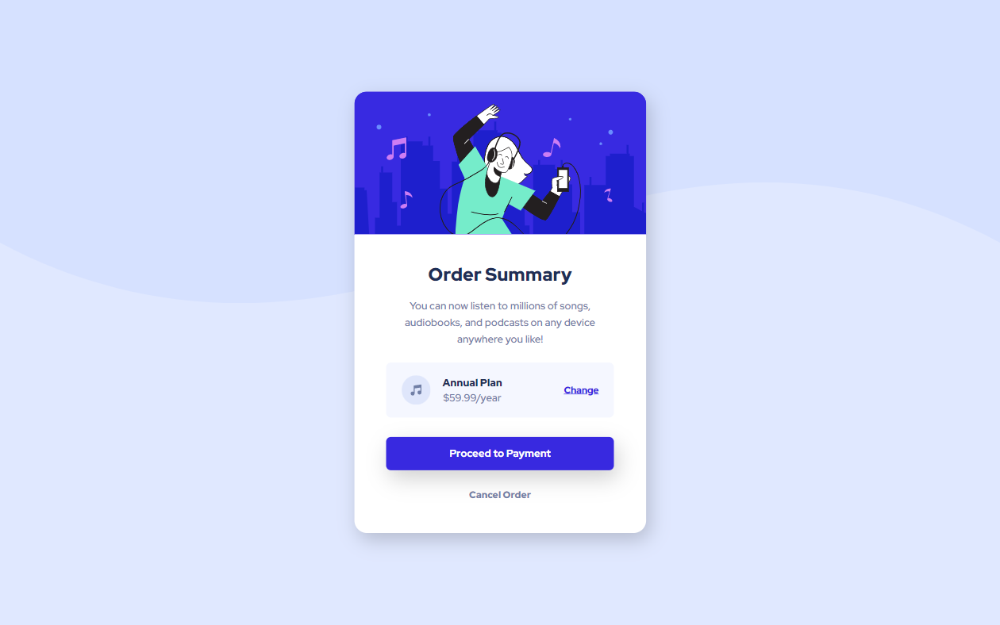

# Frontend Mentor - Order summary card solution

This is a solution to the [Order summary card challenge on Frontend Mentor](https://www.frontendmentor.io/challenges/order-summary-component-QlPmajDUj)

## Table of contents

- [Overview](#overview)
  - [The challenge](#the-challenge)
  - [Screenshot](#screenshot)
  - [Links](#links)
- [My process](#my-process)
  - [Built with](#built-with)
  - [What I learned](#what-i-learned)
  - [Continued development](#continued-development)
- [Author](#author)

## Overview

### The challenge

Users should be able to:

- See hover states for interactive elements

### Screenshot

Desktop

Mobile

### Links

- [Live Site](https://gc18-order-summary.netlify.app)

## My process

### Built with

- Semantic HTML5 markup
- CSS custom properties
- Flexbox
- Mobile-first workflow

### What I learned

I took on this project to practice using `background-image` for image components like these on cards. Looking back at my old udemy project, I realized how valuable it is to set `background-size` to `cover` and `background-position` to center.

After that, I just give my image box a set height.

Another thing, though. Despite setting `background-size` to `cover`, sometimes there will be a bit of whitespace that appears around the image. I've learned from my previous profile card project that a solution to this would be to give the container of the `background-image` a matching `background-color`.

### Continued development

I have to come back to a few of my previous projects to redo the background images from using `` to `background-image`

## Author

- Frontend Mentor - [@GioCura](https://www.frontendmentor.io/profile/GioCura)
