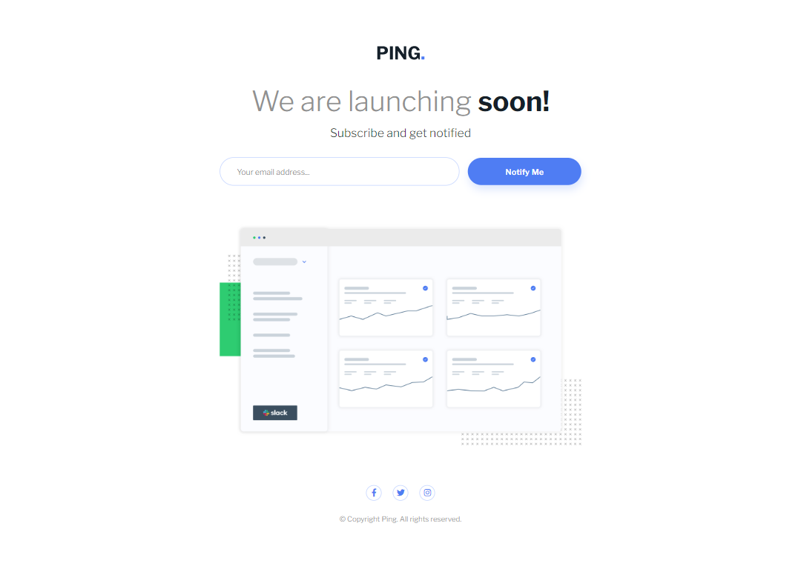
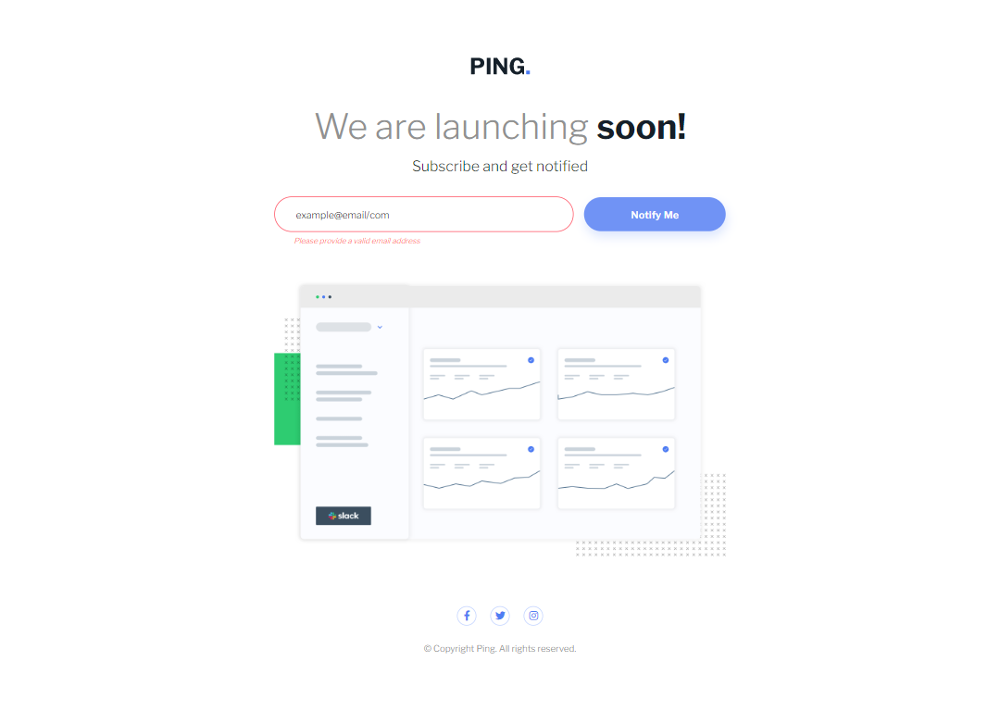
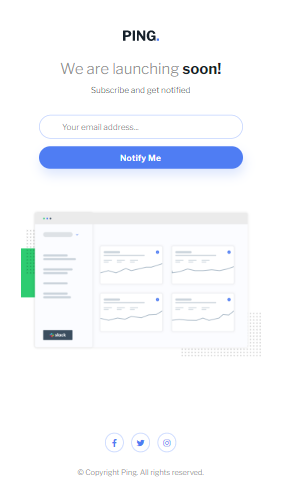
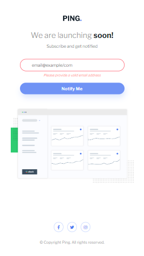
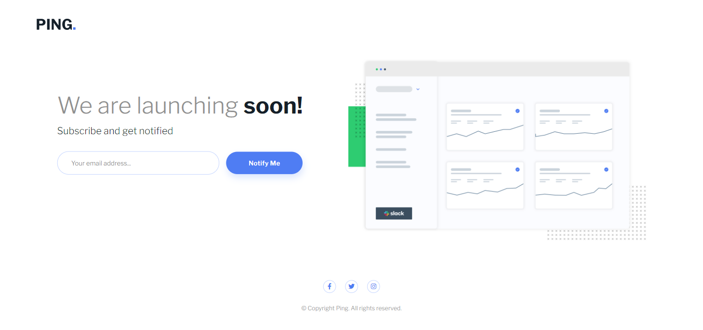

# Frontend Mentor - Ping coming soon page solution

This is a solution to the [Ping coming soon page challenge on Frontend Mentor](https://www.frontendmentor.io/challenges/ping-single-column-coming-soon-page-5cadd051fec04111f7b848da).

## Table of contents

- [Overview](#overview)
  - [The challenge](#the-challenge)
  - [Screenshot](#screenshot)
  - [Links](#links)
- [My process](#my-process)
  - [Built with](#built-with)
  - [What I learned](#what-i-learned)
  - [Continued development](#continued-development)
- [Author](#author)

## Overview

### The challenge

Users should be able to:

- View the optimal layout for the site depending on their device's screen size
- See hover states for all interactive elements on the page
- Submit their email address using an `input` field
- Receive an error message when the `form` is submitted if:
  - The `input` field is empty. The message for this error should say _"Whoops! It looks like you forgot to add your email"_
  - The email address is not formatted correctly (i.e. a correct email address should have this structure: `name@host.tld`). The message for this error should say _"Please provide a valid email address"_

### Screenshot

Desktop

Desktop - Active and Error

Mobile

Mobile - Active and Error

Small Laptops


### Links

- [Live Site](https://gc19-ping-coming-soon.netlify.app)

## My process

### Built with

- Semantic HTML5 markup
- CSS custom properties
- Flexbox
- Vanilla JS
- Mobile-first workflow

### What I learned

- This isn't my first time making something with form validation, so I was able to reuse a bit of my code from a previous project.

- However, this time, I managed to animate the form validation by adding and removing an active state's opacity, and then, delete the error message via `setTimeOut()`, like so:

```
email.addEventListener("change", () => {
  if (email.validity.valid) {
    email.className = "";
    const handle = setTimeout(() => {
      emailErrorEl.textContent = "";
      clearTimeout(handle);
    }, 1000);
  } else {
    emailError();
  }
});
```

- I also learned how to definitively center an icon in a circle. It involves adding the `display: inline-block` and `vertical-align: middle` to its nesting element.

- Also, in order to adjust the parent element's `margin-bottom` when the `invalid` class is added to my form, I learned how to use the `:has()` pseudoclass, like so:

```
.hero__details:has(.invalid) {
  margin-bottom: 3.5rem;
}
```

However, this feature is not adopted by Firefox as of this commit. So, I opted to add an invalid class to `.hero__details`.

- I noticed that I was much quicker in deciding upon a responsive layout for this on small screens.

### Continued development

More practice landing pages, and forms!

## Author

- Frontend Mentor - [@GioCura](https://www.frontendmentor.io/profile/GioCura)
