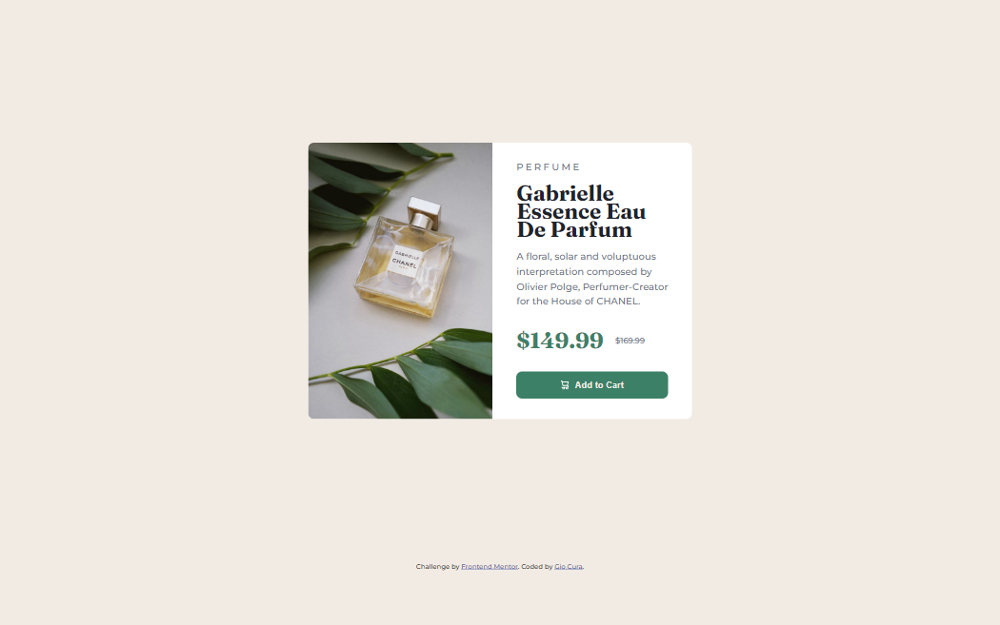
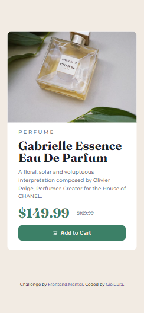

# Frontend Mentor - Product Preview Card Component - Feb. 20-21, 2023

This is my solution to the [Product Preview Card Component Challenge](https://www.frontendmentor.io/challenges/qr-code-component-iux_sIO_H).

## Table of contents

- [Overview](#overview)
  - [Screenshot](#screenshot)
  - [Links](#links)
- [My process](#my-process)
  - [Built with](#built-with)
  - [What I learned](#what-i-learned)
  - [Continued development](#continued-development)
- [Author](#author)

## Overview

### Screenshots

Desktop

Mobile

### Links

- [Live URL](https://gc6-productreviewcard.netlify.app/)

## My process

Unlike my first sumbission, I went for a mobile-first approach. I stuck to flexbox again, since I feel like components of this nature use it.

### Built with

- HTML5
- CSS3
- Mobile-first approach
- (Updated 02/25/2023) BEM

### What I learned

- My experience at the beginning of this project was the same as the first one. It's just that I had to use a lot of nested elements here!

- I divided each paragraph line into `` elements the last time, which worked well to keep the alignment consistent even when resizing. I tried to do the same here, until I realized that the alignment changes in the desktop version! It's too messy to just lump all the text in one `
` element, that is until I added ` ` elements!

  To make the shift to the desktop version, all I had to do was display and hide certain ` ` elements using media queries.

- I initially settled on using srcset/sizes to make the image responsive, but it wasn't fluid. Since it's just one version, I just wrote the two images in the html and changed their 'display' states through media queries.

### Continued development

- I feel like I took a lot of time to figure out how to correctly flex each item in the card. I'd like to practice imagining the layout of more cards like this just by looking at them.

- The same thing with adjusting the layout for the desktop version. Putting it in the correct orientation is easy enough, but it took me a long time to figure out how the sizes of the fonts and images correspond to making everything fit flush in the card.

## Author

- Frontend Mentor - [@GioCura](https://www.frontendmentor.io/profile/GioCura)
