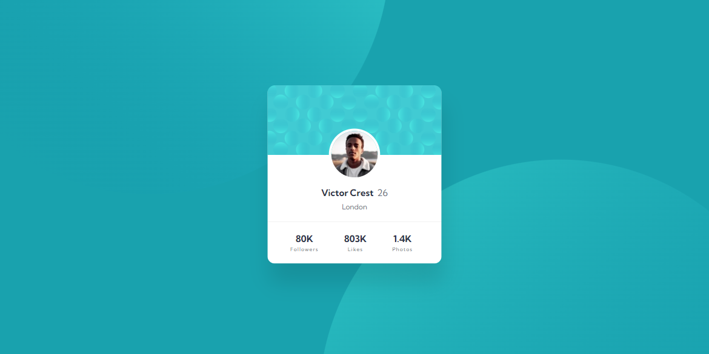
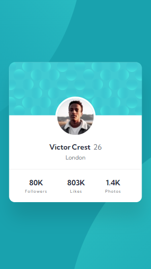

# Frontend Mentor - Profile card component solution

This is a solution to the [Profile card component challenge on Frontend Mentor](https://www.frontendmentor.io/challenges/profile-card-component-cfArpWshJ).

## Table of contents

- [Overview](#overview)
  - [The challenge](#the-challenge)
  - [Screenshot](#screenshot)
  - [Links](#links)
- [My process](#my-process)
  - [Built with](#built-with)
  - [What I learned](#what-i-learned)
  - [Continued development](#continued-development)
- [Author](#author)
- [Acknowledgments](#acknowledgments)

## Overview

### The challenge

- Build out the project to the designs provided

### Screenshot

Desktop view

Mobile view

### Links

- [Live Site URL](https://gc13-profile-card.netlify.app)

## My process

### Built with

- Semantic HTML5 markup
- CSS custom properties
- Flexbox
- Mobile-first workflow
- BEM

### What I learned

- I chose this project because I wanted to learn how to implement the background components. I used `background-image` to implement both of them.

- The card's background was easy enough, but I didn't know how to implement the two background components of the body in a way that they would scale along with the viewport and, along with that, retain their position with the card.

- I tried using `rem` units, first, but those don't scale. `%` units are, to my limited skill with them, iffy to use.

- I discovered that one can use `vh` and vw` units for this case, since those do what I'm looking for.

- Also, I learned that I could use `right`, `left, `top`, and `bottom`for`background-positio`n. Using those would specify a corresponding edge that the background image would be placed against. So, if I said `right 45vw`it would mean that the background image would expand to`45vw` against the right. This effectively pushes it to the left.

- I could use `%` for `border-radius`. This seems useful when I want an image to be a perfect circle.

- However, depending maybe on the image, there might be a gap between the image and the `border-radius-. I solved this here by adding a `background color`matching the border to the image itself, and using`object-fit: contain`.

- Similarly, I had to set the card's background image to `background-size: contain`.

### Continued development

- I'd like to do more projects with responsive backgrounds like this. Something that lets me play with the background's size and positioning.

## Author

- Frontend Mentor - [@GioCura](https://www.frontendmentor.io/profile/GioCura)

## Acknowledgments

[@LadyoftheCave's solution to this challenge](https://www.frontendmentor.io/solutions/profile-card-component-solution-_NH5vYR04) helped me understand how to make the two background components be responsive to the viewport width and height using vw and vh units. Also, through her project I learned that I could give right, left, top, and bottom specifications for background-position. I would have been stuck for hours if I hadn't resorted to looking at her solution.

I tried to make my own measurements, but hers have just the right balance for both mobile and desktop version that I ultimately settled for exactly what she input. Again, thank you to her!
