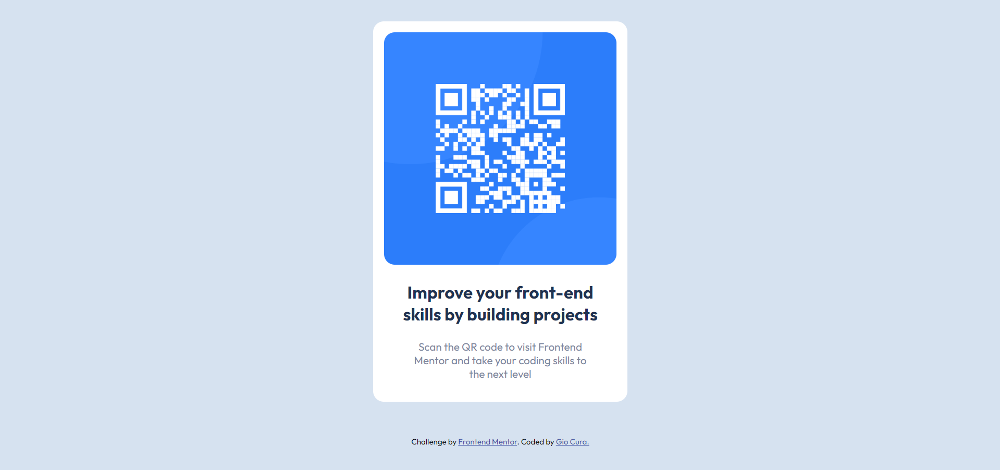

# Frontend Mentor - QR code component solution - 02/20/2023

This is my solution to the [QR code component challenge on Frontend Mentor](https://www.frontendmentor.io/challenges/qr-code-component-iux_sIO_H).

## Table of contents

- [Overview](#overview)
  - [Screenshot](#screenshot)
  - [Links](#links)
- [My process](#my-process)
  - [Built with](#built-with)
  - [What I learned](#what-i-learned)
  - [Continued development](#continued-development)
- [Author](#author)

## Overview

### Screenshots

Desktop

Mobile

### Links

- [Live Site](https://gc5-qrcomponent.netlify.app)

## My process

I started with the HTML, keeping in mind the containers that I will use to flex each component.

Then, I focused on styling the card elements so that they will stay centered in the viewport. The paddings were my next concern. I remembered to universally set the `margin` and `padding` to `0`, as well as to set the sizing to `border-box`. After that, I played around with the size values of the image and text. Once satisfied, I set the media queries for smaller screens.

### Built with

- HTML5
- CSS3
- (Update: 02/25/2023) - BEM

### What I learned

- It's been a few months since I've started studying web development, but this is the first time I'm doing projects from Front End Mentor. I haven't even used Github before this. So, I've learned a lot.

- I started use this shortcut that I saw in Kevin Powell's videos:

  ex. writing .container results in `

`

  I could shave so much time if I consistently do that.

### Continued development

- I've learned that I'm not yet familiar with all the different ways to center elements in the screen. I instinctively choose flexbox to get this done, but I'm still confused sometimes about setting the widths and heights between parent and child elements.

- Add to that, I'm not confident about whether to use percentage or viewport units (vh, vw).

- A nasty habit of mine: I forget to do a mobile-first approach when designing.

## Author

- Frontend Mentor - [@GioCura](https://www.frontendmentor.io/profile/GioCura)
