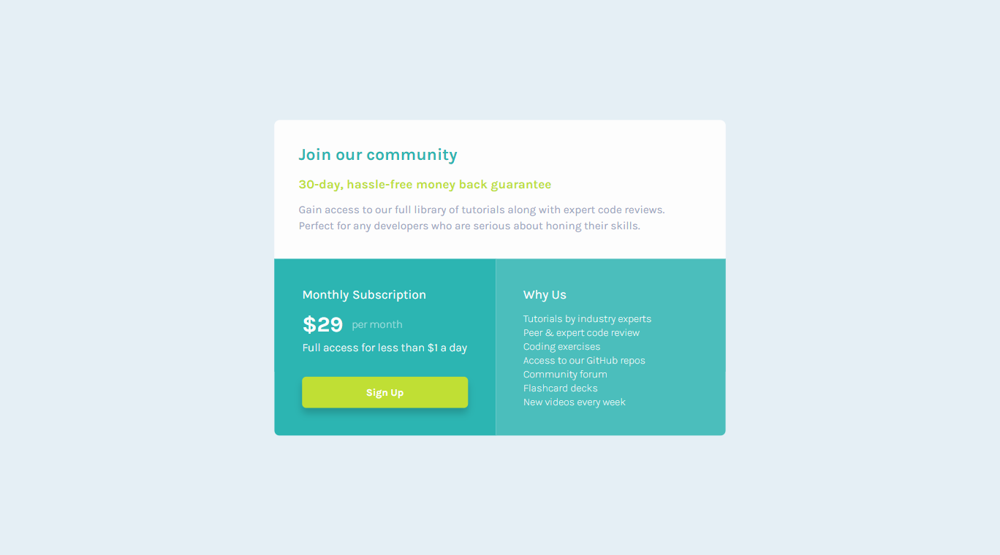

# Frontend Mentor - Single price grid component solution

This is a solution to the [Single price grid component challenge on Frontend Mentor](https://www.frontendmentor.io/challenges/single-price-grid-component-5ce41129d0ff452fec5abbbc).

## Table of contents

- [Overview](#overview)
  - [The challenge](#the-challenge)
  - [Screenshot](#screenshot)
  - [Links](#links)
- [My process](#my-process)
  - [Built with](#built-with)
  - [What I learned](#what-i-learned)
  - [Continued development](#continued-development)
- [Author](#author)

## Overview

### The challenge

Users should be able to:

- View the optimal layout for the component depending on their device's screen size
- See a hover state on desktop for the Sign Up call-to-action

### Screenshot

Desktop

Screenshot

### Links

- [Live Site](https://gc20-single-price-grid.netlify.app)

## My process

### Built with

- Semantic HTML5 markup
- CSS custom properties
- Flexbox
- CSS Grid
- Mobile-first workflow

### What I learned

I chose to do this project because I wanted to practice using `grid`. All this time, I've gotten by using `flex`, but I know that I'd better master `grid` if I ever want to make more asymmetrical layouts.

For this one, I practiced using the `grid-template-areas` property to make the desktop version. I learned that alongside that, I can still use `grid-template-columns` to distribute the spacing.

### Continued development

More practice using `grid`, and its more advanced properties.

## Author

- Frontend Mentor - [@GioCura](https://www.frontendmentor.io/profile/GioCura)
