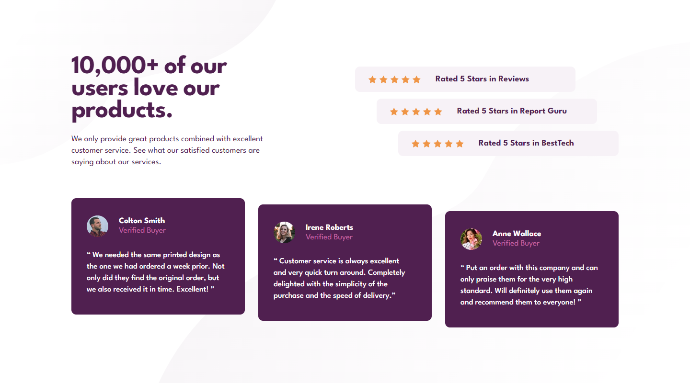

# Frontend Mentor - Social proof section solution

This is a solution to the [Social proof section challenge on Frontend Mentor](https://www.frontendmentor.io/challenges/social-proof-section-6e0qTv_bA).

## Table of contents

- [Overview](#overview)
  - [The challenge](#the-challenge)
  - [Screenshot](#screenshot)
  - [Links](#links)
- [My process](#my-process)
  - [Built with](#built-with)
  - [What I learned](#what-i-learned)
  - [Continued development](#continued-development)
  - [Useful resources](#useful-resources)
- [Author](#author)
- [Acknowledgments](#acknowledgments)

## Overview

### The challenge

Users should be able to:

- View the optimal layout for the section depending on their device's screen size

### Screenshot

Desktop

Mobile

### Links

- [Live Site](https://gc22-social-proof.netlify.app)

## My process

### Built with

- Semantic HTML5 markup
- CSS custom properties
- Flexbox
- CSS Grid
- Mobile-first workflow

### What I learned

- I continued learning more about using `grid`. I used `.` to mark an empty space in `grid-template-areas`. This was necessary in laying out the desktop design.

- To achieve the `staircase` design of the ratings and testimonials, I used flexbox and the `align-self` attribute. I simply set each item to `start`, `center`, and `end`.

- I also reinforced my knowledge of using `background-position`. I learned that I can basically use it to pin the background element to the corner's of the page (ex. `top left`).

- I did a trick to make the height responsive up to a certain point. I set the grid's height to a certain `vh` viewport unit, but only for screens as tall as `800px`. From `8001px` and taller, I gave the grid a set `column-gap`. This ensures that the entire page can be viewable on smaller laptops and tablets, but will not over-expand on large monitors.

- Also, I opted to use `background-image` for the stars, because inserting that as an `` 15 times in the html makes it seem bloated, in my opinion. They're only decorative elements, anyway.

### Continued development

- More practice using grid! I was able to copy the project's design well enough, but I still tend to overthink and overcomplicate the `grid` settings.

- And also, from now on, learning how to design the site using figma files instead of eyeballing it (meaning, I'll become a pro member of Frontendmentor).

### Useful resources

- [DanielId's answer to this stackoverflow question](https://stackoverflow.com/questions/51123242/how-can-i-achieve-responsive-height-with-css-grid) taught me how to make a grid's height responsive by using the `vh` viewport unit.

## Author

- Frontend Mentor - [@GioCura](https://www.frontendmentor.io/profile/GioCura)

## Acknowledgments

[@Karlisha's solution](https://www.frontendmentor.io/solutions/social-proof-section-LWcIukeaj) was crucial to figuring out where the background elements were positioned on the mobile version, because I could barely make them out with the given jpegs 😝. It also gave me the idea to use `align-self` for the rating and testimonials. Much credit to her!
