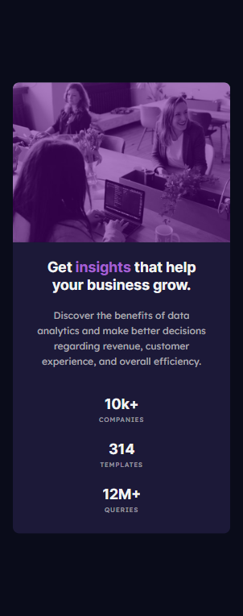

# Frontend Mentor - Stats preview card component solution

This is a solution to the [Stats preview card component challenge on Frontend Mentor](https://www.frontendmentor.io/challenges/stats-preview-card-component-8JqbgoU62).

## Table of contents

- [Overview](#overview)
  - [The challenge](#the-challenge)
  - [Screenshot](#screenshot)
  - [Links](#links)
- [My process](#my-process)
  - [Built with](#built-with)
  - [What I learned](#what-i-learned)
  - [Continued development](#continued-development)
- [Author](#author)
- [Acknowledgments](#acknowledgments)

## Overview

### The challenge

Users should be able to:

- View the optimal layout depending on their device's screen size

### Screenshot

Desktop

Tablet-Landscape

Tablet-Portrait

Mobile

### Links

- [Live Site](https://gc15-stats-preview.netlify.app)

## My process

### Built with

- Semantic HTML5 markup
- CSS custom properties
- Flexbox
- CSS Grid
- Mobile-first workflow
- Fluid sizing

### What I learned

The biggest thing I learned in this project is the use of `order` for dictating the order of flex items. This was necessary because this card's image is on top for mobile devices but on the right (after) of the text for desktops.

I also learned that I'm only able to set the pseudoelement overlay for image on it's nesting element (either `div` or `picture`)

### Continued development

I need more practice figuring out when it's best to use fluid typography/sizing and when it's more convenient to just have hard media queries. Although this took me within a day, I spent quite a bit of time overthinking fluidity.

## Author

- Frontend Mentor - [@GioCura](https://www.frontendmentor.io/profile/GioCura)

## Acknowledgments

Thanks to Zellene for always keeping me sane.
