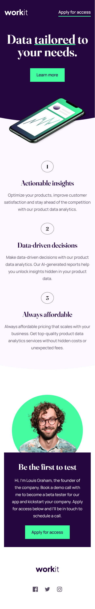

# Frontend Mentor - Workit landing page solution

This is a solution to the [Workit landing page challenge on Frontend Mentor](https://www.frontendmentor.io/challenges/workit-landing-page-2fYnyle5lu).

## Table of contents

- [Overview](#overview)
  - [The challenge](#the-challenge)
  - [Screenshot](#screenshot)
  - [Links](#links)
- [My process](#my-process)
  - [Built with](#built-with)
  - [What I learned](#what-i-learned)
  - [Continued development](#continued-development)
  - [Useful resources](#useful-resources)
- [Author](#author)

## Overview

### The challenge

Users should be able to:

- View the optimal layout for the interface depending on their device's screen size
- See hover and focus states for all interactive elements on the page

### Screenshot

### Links

- [Live Site](https://gc34-workit-landing.netlify.app/)

## My process

### Built with

- Semantic HTML5 markup
- CSS custom properties
- Flexbox
- Vanilla JS
- Mobile-first workflow

### What I learned

I learned how to use `clip-path` to make the curved borders for this layout. The background color and curve itself were applied via pseudoelements.

I couldn't figure out how to get the curve's exact values from Figma, so instead I used glass2k, a program that could render windows transparent. I overlayed my site on the figma mockup, and matched the curve's dimensions there.

I similarly used a pseudoelement to draw the underline for the word "tailored" inside the `<h1>` tag.

I also learned that setting `z-index: 1` to a container with `position: relative` actually does make a difference. In this case, I had to make sure that the background color underneath the curved background would still show up.

As I was finishing up the project with animations, I also started to wonder how people with JS disabled can access my site. I learned to use the `<noscript>` tag on the head and make a `no-js` class that overrides the attributes of my animations.

### Continued development

From now on I'd like to make projects with fallbacks for users that have JavaScript disabled.

I'd like to take on designs with more challenging `clip-path` shapes.

### Useful resources

- [The glass2k program](https://chime.tv/products/glass2k.shtml) helped me match my layout to the figma design.
- [This SO thread](https://stackoverflow.com/questions/62105821/how-does-the-clip-path-ellipse-property-work) explained how to set parameters with `clip-path`
- [This SO thread](https://stackoverflow.com/questions/22203063/how-to-write-css-fallbacks-for-when-javascript-is-disabled) helped me figure out how to make a fallback for the fade-in animations if the user has JavaScript disabled.

## Author

- Frontend Mentor - [@GioCura](https://www.frontendmentor.io/profile/GioCura)
